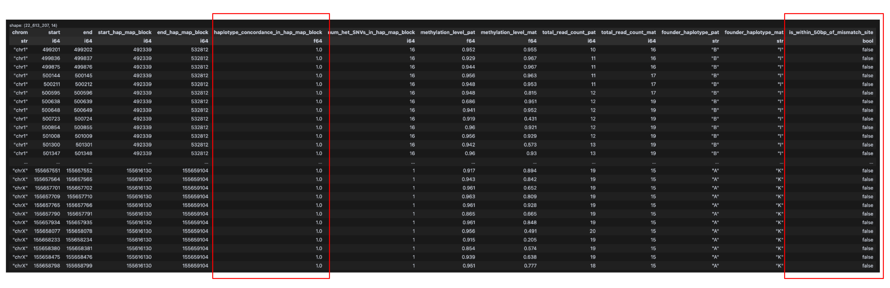
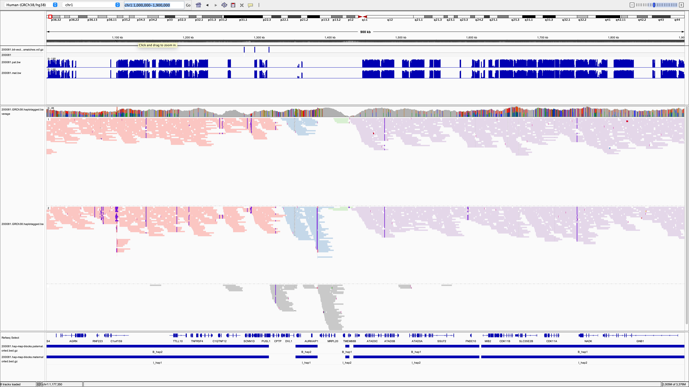

# tapestry

A pipeline to phase DNA methylation from HiFi reads in a human pedigree to the haplotypes of the pedigree's founders. 

## Dependencies

We assume the following command-line tools are in the user's PATH: 

* `bedGraphToBigWig`, `bgzip`, `tabix`
* `gtg-ped-map`, `gtg-concordance` (https://github.com/Platinum-Pedigree-Consortium/Platinum-Pedigree-Inheritance)
* `hiphase` (https://github.com/PacificBiosciences/HiPhase)
* `aligned_bam_to_cpg_scores` (https://github.com/PacificBiosciences/pb-CpG-tools)

## Installation 

Install the python dependencies:

```
/path/to/python3.11 -m venv .venv 
source .venv/bin/activate 

# https://github.com/brentp/cyvcf2?tab=readme-ov-file#github-building-htslib-and-cyvcf2-from-source
cd $HOME 
git clone --recursive https://github.com/brentp/cyvcf2
cd cyvcf2
pip install -r requirements.txt 
CYVCF2_HTSLIB_MODE=EXTERNAL python setup.py install

cd /path/to/tapestry
pip install -r requirements.txt
```

## Pedigree-wise workflow 

1. Phase variants:
   - Phase variants using read-backed phasing with the `run-hiphase.sh` script.
   - Build an inheritance-based haplotype map and inheritance-phase variants using the `build-iht-based-haplotype-map-and-phase-variants.sh` script.
2. Use `aligned_bam_to_cpg_scores.sh` to generate methylation levels from the haplotagged BAM files produced in step 1.
3. Phase methylation data to founder haplotypes using the `phase_meth_to_founder_haps.sh` script, which uses the data produced in steps 1 and 2.

## Example use of CL tool that phases DNA methylation to founder haplotypes 

```
vcf_read_phased="${read_phased_dir}/${uid}.GRCh38.deepvariant.glnexus.phased.vcf.gz" # single-sample vcf from hiphase
tsv_read_phase_blocks="${read_phased_dir}/${uid}.GRCh38.hiphase.blocks.tsv" # single-sample tsv from hiphase
vcf_iht_phased="${iht_phased_dir}/CEPH1463.GRCh38.pass.sorted.vcf.gz" # joint-called multi-sample vcf from gtg-ped-map/gtg-concordance
txt_iht_blocks="${iht_phased_dir}/CEPH1463.GRCh38.iht.sorted.txt" # multi-sample iht blocks file from gtg-ped-map/gtg-concordance
bed_meth_hap1="${meth_read_phased_dir}/${uid}.GRCh38.haplotagged.hap1.bed.gz" # bed file from aligned_bam_to_cpg_scores for hap1
bed_meth_hap2="${meth_read_phased_dir}/${uid}.GRCh38.haplotagged.hap2.bed.gz" # bed file from aligned_bam_to_cpg_scores for hap2

nohup python src/phase_meth_to_founder_haps.py \
   --pb_cpg_tool_mode ${pb_cpg_tool_mode} \
   --uid ${uid} \
   --vcf_read_phased ${vcf_read_phased} \
   --tsv_read_phase_blocks ${tsv_read_phase_blocks} \
   --vcf_iht_phased ${vcf_iht_phased} \
   --txt_iht_blocks ${txt_iht_blocks} \
   --bed_meth_hap1 ${bed_meth_hap1} \
   --bed_meth_hap2 ${bed_meth_hap2} \
   --output_dir ${output_dir} \
   > ${output_dir}/${uid}.log 2>&1 &

```

This will produce a log file that looks like: 

```
2025-07-30 17:44:00 - INFO - Got read-based phasing data: 2445352 rows, 8 columns
2025-07-30 17:44:00 - INFO - Got read-based phase blocks: 10017 rows, 7 columns
2025-07-30 17:47:04 - INFO - Got inheritance-based phasing data: 2192365 rows, 7 columns
2025-07-30 17:47:04 - INFO - Got inheritance-based phase blocks: 1329 rows, 5 columns
2025-07-30 17:47:10 - INFO - Got all phasing data: 2189885 rows, 15 columns
2025-07-30 17:47:20 - INFO - Got hap map: 8904 rows, 7 columns
2025-07-30 17:47:20 - INFO - Got sites: 2189885 rows, 5 columns
2025-07-30 17:47:20 - INFO - Got sites mismatch: 33390 rows, 5 columns
2025-07-30 17:47:21 - INFO - Wrote paternal and maternal hap-map blocks for IGV visualization
2025-07-30 17:47:21 - INFO - Wrote hap-map blocks
2025-07-30 17:47:21 - INFO - Wrote bit-vector sites and mismatches for IGV visualization
2025-07-30 17:47:44 - INFO - Got read-based phasing of methylation levels: 23818311 rows, 7 columns
2025-07-30 17:50:07 - INFO - Phased methylation levels to founder haplotypes: 23818311 rows, 14 columns
2025-07-30 17:50:07 - INFO - Percentage of CpG sites that are phased to founder haplotypes: 95%
2025-07-30 17:50:08 - INFO - Percentage of CpG sites that are within 50bp of a mismatch site: 0.182%
2025-07-30 17:50:16 - INFO - Wrote methylation levels phased to founder haplotypes
2025-07-30 17:52:47 - INFO - Wrote bigwig file for paternal methylation levels
2025-07-30 17:55:15 - INFO - Wrote bigwig file for maternal methylation levels
2025-07-30 17:55:16 - INFO - Done running /scratch/ucgd/lustre-labs/quinlan/u6018199/tapestry/phase_meth_to_founder_haps.py
```

and phases DNA methylation to founder haplotypes with various QC stats: 



The tool also creates files that enables visualization of phased DNA methylation in IGV: 



## TODO

- [ ] Convert manual workflow into a Snakemake workflow (see `Snakefile`)
