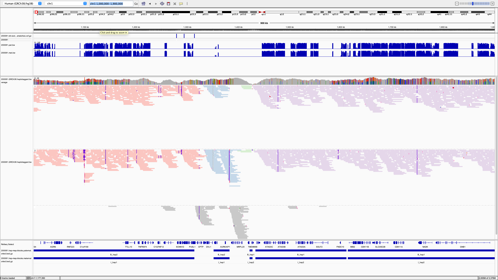
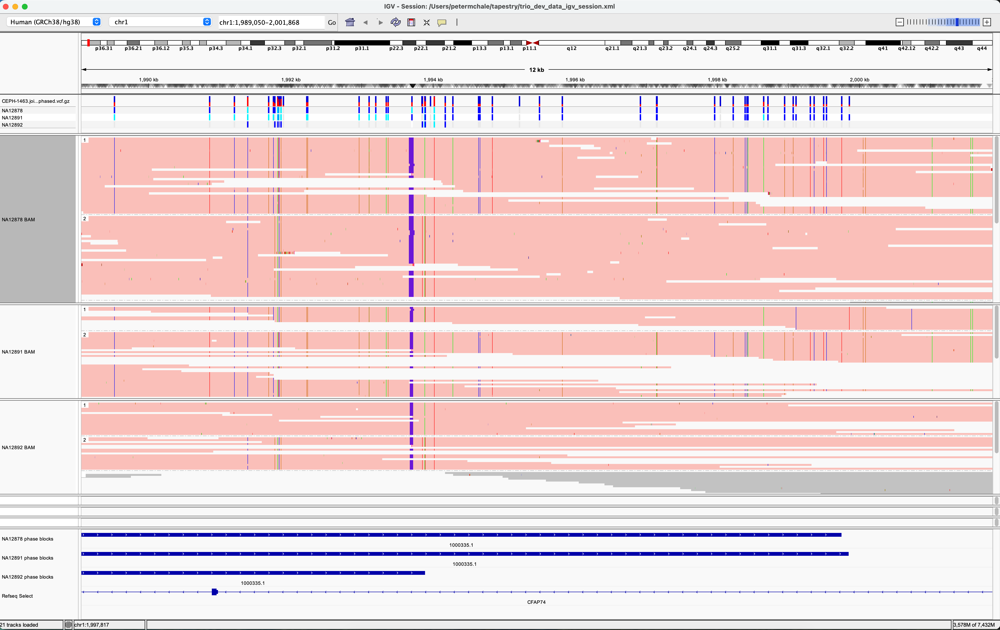
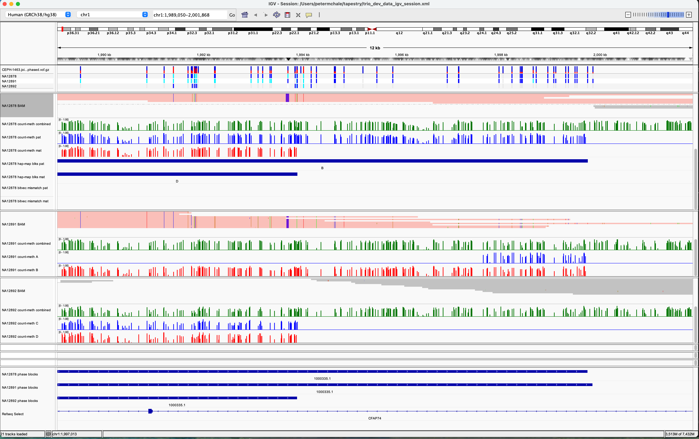
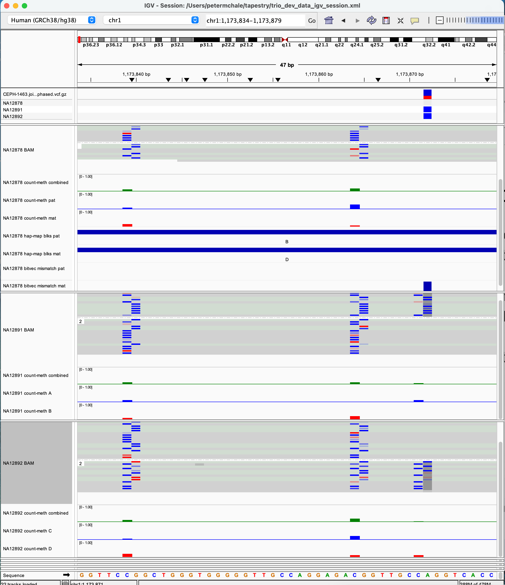

# tapestry

A pipeline to phase DNA methylation from HiFi reads in a human pedigree (including, as a special case, a trio) to the haplotypes of the pedigree's founders. 

## Generic WDL-output workflow

The generic Nextflow workflow consumes a completed miniwdl run of the PacBio
HiFi human WGS `family` WDL. It supports GRCh38 autosomes, pedigree mode, model
methylation, and WDL v3.3.0 or v3.3.1. It does not call HiPhase or
pb-CpG-tools: those products come from the WDL.

```bash
nextflow run . -profile slurm,apptainer \
  --outputs-json /path/to/miniwdl-run/outputs.json \
  --ped /path/to/family.ped \
  --reference-fasta /path/to/GRCh38.fa \
  --outdir /path/to/tapestry-results \
  --container /path/to/tapestry.sif \
  -resume
```

The FASTA index defaults to `<reference-fasta>.fai`; override it with
`--reference-index`. Tapestry detects the WDL release from `workflow_version`,
selects every PED member with both parents present, and processes `chr1` through
`chr22`. Optional overrides include `--samples CHILD1,CHILD2`,
`--regions chr1,chr2`, `--min-coverage 10`, `--mismatch-window-bp 50`, and
`--bigwig false`. Inheritance thresholds are exposed as `--map-min-qual`,
`--map-min-depth`, `--min-run-markers`, `--concordance-min-qual`, and
`--concordance-min-depth`; their respective defaults are 20, 10, 10, 20, and
5. Validation prints every effective scientific setting and records it in
`pipeline_info/resolved-run.json`.

The full command always validates before starting scientific processes. For an
optional preflight that stops after validation, add `-entry validate`:

```bash
nextflow run . -entry validate -profile docker \
  --outputs-json /path/to/miniwdl-run/outputs.json \
  --ped /path/to/family.ped \
  --reference-fasta /path/to/GRCh38.fa \
  --outdir /path/to/tapestry-results
```

Validation converts miniwdl outputs into Tapestry's internal canonical manifest,
verifies the PED and exact VCF/output sample sets, checks reference and indexed
artifact headers and indexes without scanning genome-wide records, and publishes `resolved-run.json`,
`resolved-manifest.json`, normalized inputs, and a validation report under
`<outdir>/pipeline_info/`. It also prints the selected family, samples, WDL
release, reference regions, coverage threshold, BigWig choice, and output
directory. Record-level checks happen in the scientific stage that consumes each
artifact. Users do not author an intermediate run configuration or manifest.

The full workflow publishes `pipeline_info/`, `reference/`, `inheritance/`,
`visualizations/`, one directory under `samples/` for each selected eligible
pedigree member, and `results-manifest.json` beneath `<outdir>`. The manifest contains only
published relative paths, identifies indexed artifacts, and records count mode
as disabled. Completion prints the manifest path and per-sample status counts.
Open `<outdir>/visualizations/haplotype-ancestry/index.html` for an offline
interactive chromosome painting of the raw `gtg` inheritance blocks. Copy the
entire `haplotype-ancestry/` directory when moving the visualization between
systems. Select a
sample to see its two haplotype stripes across every configured chromosome,
then click a block to paint that chromosome across the PDF-style pedigree. The
clicked founder haplotype is emphasized wherever it occurs in the family while
unrelated blocks are muted. Adjacent map intervals with the same label are
merged visually into one inherited run, while coordinates and labels remain
those of the published `.iht.sorted.txt`. Blank chromosome spans mean that the
inheritance map contains no block there, not that a particular sample lacks
sequencing. Internal `gtg` founder codes such as `A` and `B` are displayed as
the corresponding PED sample haplotypes (for example, `FOUNDER hap1` and
`FOUNDER hap2`). The bundle stores one data shard per sample for the overview
and one per chromosome for the pedigree, loading each only when requested. The
sample selector prefixes every ID with its pedigree generation (`F0`, `F1`, and
so on), aligning married-in individuals with their partners. Downstream targets
have no status suffix; other pedigree members are marked `inheritance map only`,
which describes Tapestry output status rather than sequencing status. The
bundle can be opened locally without a web server or network connection.
Founder phasing fetches read-backed and inheritance VCF records one configured
autosome at a time, retaining only compact hap-map and mismatch results between
chromosomes. It then reads indexed hap1/hap2 model BEDs by autosome, appends rows
in canonical order, and writes BigWigs in bounded chunks. Peak variant and
methylation working memory therefore scale with the largest selected chromosome
rather than the whole genome, without changing output schemas or overlap
semantics. BigWig projection collapses repeated intervals only when their
non-null methylation values agree; conflicting values fail explicitly rather
than being averaged or selected arbitrarily.
Docker, Apptainer, and Slurm profiles are defined in
[`nextflow.config`](nextflow.config); site-specific queues and resource policy
should be supplied by a local profile.
Nextflow's trace, report, timeline, and DAG are written to
`.nextflow-reports/` in the launch directory and overwritten safely on a
`-resume` run; standard `-with-*` options can redirect them.

The OCI image defined by [`Dockerfile`](Dockerfile) contains the pinned Python
environment, bcftools/tabix, and `gtg` commit
`e12aca6b49ee7208952467db4a2a9e2f79b98efb`. It also contains a
checksum-pinned UCSC `bedGraphToBigWig` binary solely as the parity oracle for
the `pyBigWig` migration test; production tracks use `pyBigWig`. Override the development image with
`--container <image-or-digest>` until a release digest is published.

## Dependencies

The generic workflow obtains its tools from the configured container. The
legacy shell workflows below assume the following command-line tools are in the
user's PATH:

* `bgzip`, `tabix`, `bcftools`
* `gtg-ped-map`, `gtg-concordance` (https://github.com/Platinum-Pedigree-Consortium/Platinum-Pedigree-Inheritance/blob/e12aca6b49ee7208952467db4a2a9e2f79b98efb/HAPLOTYPING.md)
* `hiphase` (https://github.com/PacificBiosciences/HiPhase)
* `aligned_bam_to_cpg_scores` (https://github.com/PacificBiosciences/pb-CpG-tools)

## Installation

Install the python dependencies:

```
/path/to/python3.11 -m venv .venv
source .venv/bin/activate

# https://github.com/brentp/cyvcf2?tab=readme-ov-file#github-building-htslib-and-cyvcf2-from-source
cd $HOME
git clone --recursive https://github.com/brentp/cyvcf2
cd cyvcf2
pip install -r requirements.txt
CYVCF2_HTSLIB_MODE=EXTERNAL python setup.py install

cd /path/to/tapestry
pip install -r requirements.txt
```

Install `bedGraphToBigWig` into the virtual environment's bin directory:

```
# Choose the binary for your platform from the official UCSC downloads. Linux
# x86_64 example:
curl -O https://hgdownload.soe.ucsc.edu/admin/exe/linux.x86_64/bedGraphToBigWig
chmod +x bedGraphToBigWig
mv bedGraphToBigWig .venv/bin/
```

## Pedigree-wise workflow 

1. Phase variants:
   - Phase variants using read-backed phasing with the `run-hiphase.sh` script.
   - Build an inheritance-based haplotype map and inheritance-phase variants using the `build-iht-based-haplotype-map-and-phase-variants.sh` script.
2. Use `aligned_bam_to_cpg_scores.sh` to generate count- and model-based methylation levels from the haplotagged BAM files produced in step 1.
3. Phase count- and model-based methylation data to founder haplotypes using the `phase_meth_to_founder_haps.sh` script, which uses the data produced in steps 1 and 2.
4. Use `expand_to_all_cpgs.sh` script to generalize tapestry's output to include all CpG sites in the reference and sample genome, and unphased count- and model-based methylation levels, where available. This step also uses heterozygous SNVs to flag CpG sites that are "allele-specific", i.e., exist in only one of the haplotypes in the sample in question. Uses output of steps 2 and 3.

### Step 3 of pedigree workflow: Phasing count- and model-based DNA methylation to founder haplotypes 

The `phase_meth_to_founder_haps.sh` script calls a CL tool called `src/phase_meth_to_founder_haps.py`: 

```
vcf_read_phased="${read_phased_dir}/${uid}.GRCh38.deepvariant.glnexus.phased.vcf.gz" # single-sample vcf from hiphase
tsv_read_phase_blocks="${read_phased_dir}/${uid}.GRCh38.hiphase.blocks.tsv" # single-sample tsv from hiphase
vcf_iht_phased="${iht_phased_dir}/CEPH1463.GRCh38.pass.sorted.vcf.gz" # joint-called multi-sample vcf from gtg-ped-map/gtg-concordance
txt_iht_blocks="${iht_phased_dir}/CEPH1463.GRCh38.iht.sorted.txt" # multi-sample iht blocks file from gtg-ped-map/gtg-concordance
bed_meth_count_hap1="${meth_count_read_phased_dir}/${uid}.GRCh38.haplotagged.hap1.bed.gz" # bed file of count-based methylation from aligned_bam_to_cpg_scores for hap1
bed_meth_count_hap2="${meth_count_read_phased_dir}/${uid}.GRCh38.haplotagged.hap2.bed.gz" # bed file of count-based methylation from aligned_bam_to_cpg_scores for hap2
bed_meth_model_hap1="${meth_model_read_phased_dir}/${uid}.GRCh38.haplotagged.hap1.bed.gz" # bed file of model-based methylation from aligned_bam_to_cpg_scores for hap1
bed_meth_model_hap2="${meth_model_read_phased_dir}/${uid}.GRCh38.haplotagged.hap2.bed.gz" # bed file of model-based methylation from aligned_bam_to_cpg_scores for hap2
regions="chr1,chr2,chr3,chr4,chr5,chr6,chr7,chr8,chr9,chr10,chr11,chr12,chr13,chr14,chr15,chr16,chr17,chr18,chr19,chr20,chr21,chr22"

nohup python src/phase_meth_to_founder_haps.py \
    --uid ${uid} \
    --vcf_read_phased ${vcf_read_phased} \
    --tsv_read_phase_blocks ${tsv_read_phase_blocks} \
    --vcf_iht_phased ${vcf_iht_phased} \
    --txt_iht_blocks ${txt_iht_blocks} \
    --bed_meth_count_hap1 ${bed_meth_count_hap1} \
    --bed_meth_count_hap2 ${bed_meth_count_hap2} \
    --bed_meth_model_hap1 ${bed_meth_model_hap1} \
    --bed_meth_model_hap2 ${bed_meth_model_hap2} \
    --regions ${regions} \
    --output_dir ${output_dir} \
    > ${output_dir}/${uid}.log 2>&1 &

```

This will produce a log file that looks like: 

```
2025-10-06 14:41:36 - INFO - Got read-based phasing data: 2445352 rows, 8 columns
2025-10-06 14:41:37 - INFO - Got read-based phase blocks: 10017 rows, 7 columns
2025-10-06 14:44:45 - INFO - Got inheritance-based phasing data: 2192365 rows, 7 columns
2025-10-06 14:44:45 - INFO - Got inheritance-based phase blocks: 1329 rows, 5 columns
2025-10-06 14:44:52 - INFO - Got all phasing data: 2189885 rows, 15 columns
2025-10-06 14:44:59 - INFO - Got hap map: 8904 rows, 7 columns
2025-10-06 14:44:59 - INFO - Got sites: 2189885 rows, 5 columns
2025-10-06 14:44:59 - INFO - Got sites where read-based and inheritance-based bit vectors don't match: 33390 rows, 5 columns
2025-10-06 14:45:00 - INFO - Wrote paternal and maternal hap-map blocks for IGV visualization
2025-10-06 14:45:00 - INFO - Wrote hap-map blocks
2025-10-06 14:45:00 - INFO - Wrote sites of bit-vectors, and sites where bit vectors are mismatched, for IGV visualization
2025-10-06 14:45:31 - INFO - Got read-based phasing of count-based methylation levels: 26729958 rows, 7 columns
2025-10-06 14:45:58 - INFO - Got read-based phasing of model-based methylation levels: 26729958 rows, 7 columns
2025-10-06 14:47:43 - INFO - Phased count-based methylation levels to founder haplotypes: 26729958 rows, 14 columns
2025-10-06 14:49:26 - INFO - Phased model-based methylation levels to founder haplotypes: 26729958 rows, 14 columns
2025-10-06 14:49:52 - INFO - Combined count- and model-based methylation levels: 26729958 rows, 16 columns
2025-10-06 14:49:52 - INFO - Percentage of CpG sites that are phased to founder haplotypes: 93%
2025-10-06 14:49:52 - INFO - Percentage of CpG sites that are within 50bp of a mismatch site: 0.183%
2025-10-06 14:49:57 - INFO - Wrote methylation levels phased to founder haplotypes
2025-10-06 14:52:15 - INFO - Wrote bigwig file for pat count-based methylation levels
2025-10-06 14:54:37 - INFO - Wrote bigwig file for pat model-based methylation levels
2025-10-06 14:56:54 - INFO - Wrote bigwig file for mat count-based methylation levels
2025-10-06 14:59:16 - INFO - Wrote bigwig file for mat model-based methylation levels
2025-10-06 14:59:17 - INFO - Done running /scratch/ucgd/lustre-labs/quinlan/u6018199/tapestry/src/phase_meth_to_founder_haps.py
```

and phases count- and model-based DNA methylation to founder haplotypes. 
The tool also creates files that collectively enable visualization of phased DNA methylation in IGV, e.g., 



### Step 4 of pedigree workflow: Expanding the dataset to include all CpG sites in the reference and the sample genome, and to include unphased DNA methylation, and to flag CpGs as "allele-specific" 

We would like to be aware of the existence of all CpG sites in the reference genome, irrespective of whether phased or unphased methylation levels are reported for those sites. Additionally, DNA methylation levels are computed at all CpG sites in the sample's haplotypes, even if those CpG sites are not in the reference genome (an example of a variant "creating" a CpG site in the sample). Conversely, CpG sites can be destroyed by mutation, and therefore a methylation level is not reported at that site on the corresponding haplotype. We call such CpG sites "allele-specific". Finally, this step of the workflow reports various QC statistics, e.g., the percentage of CpG sites (in reference and sample genomes, and on phasable chromosomes) at which count-based methylation is phased to at least one parental haplotype. See `https://github.com/quinlan-lab/tapestry/blob/main/src/expand_to_all_cpgs.200081.ipynb` for examples of all these things. 

### Output format of pedigree workflow

The bed file output by step 4 includes a header containing run metadata and column headings. The `##source=` line records the script path followed by `with args` and a dictionary of the command-line arguments passed to `src/expand_to_all_cpgs.py`. The final header line lists the column names in the form "#col1 col2 col3...". An example header is shown below:

```
##source='/scratch/ucgd/lustre-labs/quinlan/u6018199/tapestry/src/expand_to_all_cpgs.py with args {'bed_all_cpgs_in_reference': '/scratch/ucgd/lustre-labs/quinlan/data-shared/dna-methylation/CEPH1463.GRCh38.hifi.founder-phased.all-cpgs.2/all_cpg_sites_in_reference.bed', 'bed_meth_count_unphased': '/scratch/ucgd/lustre-labs/quinlan/data-shared/dna-methylation/CEPH1463.GRCh38.hifi.count.read-backed-phased/200084.GRCh38.haplotagged.combined.bed.gz', 'bed_meth_model_unphased': '/scratch/ucgd/lustre-labs/quinlan/data-shared/dna-methylation/CEPH1463.GRCh38.hifi.model.read-backed-phased/200084.GRCh38.haplotagged.combined.bed.gz', 'bed_meth_founder_phased': '/scratch/ucgd/lustre-labs/quinlan/data-shared/dna-methylation/CEPH1463.GRCh38.hifi.founder-phased/200084.dna-methylation.founder-phased.bed', 'bed_het_site_mismatches': '/scratch/ucgd/lustre-labs/quinlan/data-shared/dna-methylation/CEPH1463.GRCh38.hifi.founder-phased/200084.bit-vector-sites-mismatches.bed', 'bed_meth_founder_phased_all_cpgs': '/scratch/ucgd/lustre-labs/quinlan/data-shared/dna-methylation/CEPH1463.GRCh38.hifi.founder-phased.all-cpgs.2/200084.dna-methylation.founder-phased.all_cpgs.bed', 'uid': '200084', 'vcf_iht_phased': '/scratch/ucgd/lustre-labs/quinlan/data-shared/haplotype-maps/CEPH1463.GRCh38/CEPH1463.GRCh38.pass.sorted.vcf.gz'}'
#chrom  start_cpg       end_cpg total_read_count        methylation_level_count methylation_level_model start_hap_map_block end_hap_map_block       haplotype_concordance_in_hap_map_block  num_het_SNVs_in_hap_map_block   total_read_count_pat    total_read_count_mat    founder_haplotype_pat   founder_haplotype_mat   methylation_level_pat_count     methylation_level_mat_count     methylation_level_pat_model     methylation_level_mat_model     cpg_is_within_50bp_of_mismatch_site     cpg_overlaps_at_least_one_snv   snv_genotypes   cpg_is_allele_specific
```

Definitions of column headings: 

Column | Definition 
:--- | :---
chrom | chromosome on which CpG site is found 
start_cpg | start coordinate of CpG dinucleotide 
end_cpg | end coordinate of CpG dinucleotide 
total_read_count | total number of HiFi reads overlapping CpG site
methylation_level_count | methylation level: fraction of reads that are methylated (inferred from sequencing kinetics) at given CpG site, c.f., https://github.com/PacificBiosciences/pb-CpG-tools?tab=readme-ov-file#output-modes-and-option-details
methylation_level_model | methylation level: neural network maps sequencing kinetics at multiple CpG sites to methylation probability at a central CpG site, c.f., "Methods" section of https://www.pacb.com/wp-content/uploads/poster_saunders.pdf
start_hap_map_block | start of hap-map block (a genomic interval in which parental phasing of reads can be performed)
end_hap_map_block | end of hap-map block 
haplotype_concordance_in_hap_map_block | the degree of similarity (on a scale of 0 to 1, with 1 representing perfect similarity) of the bit vectors: sequences of alleles observed at heterozygous sites on haplotypes inferred by read-backed vs inheritance-backed phasing 
num_het_SNVs_in_hap_map_block | number of heterozygous sites in the given hap-map block 
total_read_count_pat | number of reads from the (deduced) paternal haplotype    
total_read_count_mat | number of reads from the (deduced) maternal haplotype
founder_haplotype_pat | a label indicating which of the haplotypes in a founder of the pedigree the paternal haplotype in the given individual was descended from 
founder_haplotype_mat | a similar label corresponding to the maternal haplotype of the sample 
methylation_level_pat_count | count-based methylation level on the paternal haplotype (fraction of paternal reads that are methylated)      
methylation_level_mat_count | count-based methylation level on the maternal haplotype (fraction of maternal reads that are methylated)          
methylation_level_pat_model | model-based methylation level on the paternal haplotype (deep-learning estimated methylation using only the paternal reads)     
methylation_level_mat_model | model-based methylation level on the maternal haplotype (deep-learning estimated methylation using only the maternal reads) 
cpg_is_within_50bp_of_mismatch_site | is the given CpG site within 50bp of a heterozygous site at which the read-based and inheritance-based bit vectors (allele sequences corresponding to each haplotype) are mismatched 
cpg_overlaps_at_least_one_snv | does the CpG dinucleotide overlap an SNV? 
snv_genotypes | are the SNVs (if any) that overlap CpG dinucleotide `hom` or `het`? 
cpg_is_allele_specific | does the CpG dinucleotide appear in the reads corresponding to one haplotype, but not the reads of the other haplotype? 

## Trio-wise workflow

1. Phase variants using pedMEC-based trio phasing with the `run-whatshap.sh` script.
2. Use `aligned_bam_to_cpg_scores.sh` to generate count- and model-based methylation levels from the haplotagged BAM files produced in step 1, for each trio member (kid, dad, and mom).
3. Phase count- and model-based methylation data in kid to parental haplotypes (A/B in dad, C/D in mom) using the `phase_meth_to_parent_haps.sh` script, which uses the data produced in steps 1 and 2.
4. Use `expand_to_all_cpgs.trio.sh` to generalize tapestry's output to include all CpG sites in the reference and sample genomes, unphased count- and model-based methylation levels (for all three trio members, where available), and unphased bigwig files for IGV visualization. This step also uses heterozygous SNVs to flag CpG sites that are "allele-specific" for each family member individually. Uses output of steps 2 and 3. See `https://github.com/quinlan-lab/tapestry/blob/main/src/expand_to_all_cpgs.trio.ipynb` for examples.

### Step 3 of trio workflow: Phasing count- and model-based DNA methylation in kid to parental haplotypes 

The `phase_meth_to_parent_haps.sh` script calls `src/phase_meth_to_parent_haps.py`, which phases methylation levels in the kid to the corresponding haplotypes in the parents (A/B in dad, C/D in mom), and creates files for IGV visualization, e.g.,





### Step 4 of trio workflow: Expanding the dataset to include all CpG sites, unphased methylation, and per-member allele-specific CpG labeling

This step mirrors step 4 of the pedigree-wise workflow but is adapted for a trio. The key differences are:

- **Unphased methylation for all three members**: count- and model-based unphased methylation levels are included for kid, dad, and mom (rather than just a single sample).
- **Per-member allele-specific labeling**: CpG sites are flagged as allele-specific independently for each family member (kid, dad, and mom), since a variant may be heterozygous in one member but homozygous in another.
- **Separate paternal and maternal mismatch proximity**: proximity to mismatch sites is computed separately for the paternal and maternal sides.
- **Bigwig files**: unphased methylation bigwig files are written for each trio member for IGV visualization.

Informative example of allele-specific methylation resulting from a SNP in the trio:



### Output format of trio workflow 

The bed file output by step 4 includes a header containing run metadata and column headings. The `##source=` line records the script path followed by `with args` and a dictionary of the command-line arguments passed to `src/expand_to_all_cpgs_trio.py`. The final header line lists the column names in the form "#col1 col2 col3...".

Column | Definition
:--- | :---
chrom | chromosome on which CpG site is found
start_cpg | start coordinate of CpG dinucleotide
end_cpg | end coordinate of CpG dinucleotide
total_read_count_kid | total number of HiFi reads overlapping CpG site in the kid
methylation_level_kid_count | count-based unphased methylation level in the kid
methylation_level_kid_model | model-based unphased methylation level in the kid
total_read_count_dad | total number of HiFi reads overlapping CpG site in dad
methylation_level_dad_count | count-based unphased methylation level in dad
methylation_level_dad_model | model-based unphased methylation level in dad
total_read_count_mom | total number of HiFi reads overlapping CpG site in mom
methylation_level_mom_count | count-based unphased methylation level in mom
methylation_level_mom_model | model-based unphased methylation level in mom
total_read_count_kid_pat | number of reads from the kid's paternal haplotype
methylation_level_kid_pat_count | count-based methylation level on the kid's paternal haplotype
total_read_count_kid_mat | number of reads from the kid's maternal haplotype
methylation_level_kid_mat_count | count-based methylation level on the kid's maternal haplotype
methylation_level_kid_pat_model | model-based methylation level on the kid's paternal haplotype
methylation_level_kid_mat_model | model-based methylation level on the kid's maternal haplotype
total_read_count_dad_A | number of reads from dad's haplotype A (hap1)
methylation_level_dad_A_count | count-based methylation level on dad's haplotype A
total_read_count_dad_B | number of reads from dad's haplotype B (hap2)
methylation_level_dad_B_count | count-based methylation level on dad's haplotype B
methylation_level_dad_A_model | model-based methylation level on dad's haplotype A
methylation_level_dad_B_model | model-based methylation level on dad's haplotype B
total_read_count_mom_C | number of reads from mom's haplotype C (hap1)
methylation_level_mom_C_count | count-based methylation level on mom's haplotype C
total_read_count_mom_D | number of reads from mom's haplotype D (hap2)
methylation_level_mom_D_count | count-based methylation level on mom's haplotype D
methylation_level_mom_C_model | model-based methylation level on mom's haplotype C
methylation_level_mom_D_model | model-based methylation level on mom's haplotype D
start_hap_map_block_pat | start of the paternal hap-map block
end_hap_map_block_pat | end of the paternal hap-map block
paternal_haplotype | which of dad's haplotypes (A or B) corresponds to the kid's paternal haplotype in this block
paternal_concordance | bit-vector concordance between the kid's paternal allele sequence and dad's assigned haplotype (A or B) over the het SNVs in the paternal hap-map block. Both vectors come from the same `whatshap phase --ped` run. The assigned haplotype is defined as whichever of dad's two haplotypes gives the higher concordance, so the value lies in `[0.5, 1.0]` by construction
num_het_SNVs_in_dad | number of heterozygous sites in dad within the paternal hap-map block
start_hap_map_block_mat | start of the maternal hap-map block
end_hap_map_block_mat | end of the maternal hap-map block
maternal_haplotype | which of mom's haplotypes (C or D) corresponds to the kid's maternal haplotype in this block
maternal_concordance | bit-vector concordance between the kid's maternal allele sequence and mom's assigned haplotype (C or D) over the het SNVs in the maternal hap-map block. Both vectors come from the same `whatshap phase --ped` run. The assigned haplotype is defined as whichever of mom's two haplotypes gives the higher concordance, so the value lies in `[0.5, 1.0]` by construction
num_het_SNVs_in_mom | number of heterozygous sites in mom within the maternal hap-map block
cpg_is_within_50bp_of_mismatch_site_pat | is the CpG site within 50bp of a het SNV in dad at which the kid's paternal allele disagrees with dad's assigned haplotype (a within-pedMEC bit-vector mismatch on the paternal side)
cpg_is_within_50bp_of_mismatch_site_mat | is the CpG site within 50bp of a het SNV in mom at which the kid's maternal allele disagrees with mom's assigned haplotype (a within-pedMEC bit-vector mismatch on the maternal side)
cpg_overlaps_at_least_one_snv | does the CpG dinucleotide overlap an SNV?
snv_genotypes_kid | are the SNVs (if any) that overlap the CpG dinucleotide `hom` or `het` in the kid?
cpg_is_allele_specific_kid | does the CpG dinucleotide appear in the reads of only one haplotype in the kid?
snv_genotypes_dad | are the SNVs (if any) that overlap the CpG dinucleotide `hom` or `het` in dad?
cpg_is_allele_specific_dad | does the CpG dinucleotide appear in the reads of only one haplotype in dad?
snv_genotypes_mom | are the SNVs (if any) that overlap the CpG dinucleotide `hom` or `het` in mom?
cpg_is_allele_specific_mom | does the CpG dinucleotide appear in the reads of only one haplotype in mom?

### Trio dev data

A small development dataset (region `chr1:1000000-2000000` for the CEPH1463 trio) can be created and used to run and test the trio workflow locally. The following files support this:

File | Description
:--- | :---
`trio_dev_data_config.sh` | Defines the genomic region (`DEV_REGION`) used by all other dev data scripts.
`trio_dev_data_create.sh` | Creates the dev dataset by subsetting the production VCF and BAM files to the dev region. Run on a machine with access to the production data: `./trio_dev_data_create.sh trio_dev_data`.
`trio_dev_data_get_ref.sh` | Downloads the reference FASTA for the dev region chromosome from UCSC. Only needs to be run once: `./trio_dev_data_get_ref.sh trio_dev_data`.
`serve_data_for_igv.py` | HTTP server with range-request support for serving genomic data files for IGV to consume. Roots at `--data-dir` (default `trio_dev_data/`); point it at the production tree to inspect genome-wide output. Start with `.venv/bin/python serve_data_for_igv.py` (default port 8000).
`trio_dev_data_igv_session.xml` | IGV session file that loads the dev data (haplotagged BAMs, phased VCFs, phase blocks, methylation bigwigs, and mismatch-site VCFs) over HTTP from `serve_data_for_igv.py`. The Resource paths point at `http://localhost:PORT/...`, so the server can run either locally on your laptop or remotely on CHPC (in which case tunnel with `ssh -L PORT:localhost:PORT <host>`). Open in IGV via File > Open Session after starting the server.

**The trio dev run must be performed on CHPC, not on a local machine.** Although the dev data subset (`trio_dev_data/input/`) is small enough to commit and copy around, `aligned_bam_to_cpg_scores.sh` invokes the pb-CpG-tools binary from a CHPC-only path (`/uufs/chpc.utah.edu/common/HIPAA/u6018199/pb-CpG-tools-v3.0.0-x86_64-unknown-linux-gnu/bin`), which is not available locally. Because every later step consumes its output, the entire dev chain (and therefore `phase_meth_to_parent_haps.sh`) has to be run on CHPC.

To run the trio workflow on the dev data, on CHPC:

```
# One-time setup: download the dev-region reference FASTA (see trio_dev_data_get_ref.sh above)
./trio_dev_data_get_ref.sh trio_dev_data

# Pipeline (pass --dev-dir trio_dev_data to each step):
./run-whatshap.sh --dev-dir trio_dev_data
./aligned_bam_to_cpg_scores.sh -t NA12878 NA12891 NA12892 --dev-dir trio_dev_data
./phase_meth_to_parent_haps.sh --dev-dir trio_dev_data
./expand_to_all_cpgs.trio.sh --dev-dir trio_dev_data
```

All output is written under `trio_dev_data/output/`. To inspect results in IGV, run `serve_data_for_igv.py` / `trio_dev_data_igv_session.xml` either directly on CHPC (tunnelling the port back to your laptop, as described above) or locally after copying `trio_dev_data/output/` back from CHPC. Running parts of the workflow locally on the truncated dev dataset is also useful for quick iteration, though steps that depend on the CHPC-only pb-CpG-tools binary (see above) must still be run on CHPC.

## TODO

- [ ] Convert manual workflow into a Snakemake workflow (see `Snakefile` for early version of this)
- [ ] https://quinlangroup.slack.com/archives/C09MHJSPPEE/p1770676950847639 
- [ ] https://quinlangroup.slack.com/archives/C09MHJSPPEE/p1770676759903709

## Resources 

- https://docs.google.com/document/d/1HGBhjqk4cqZaWIkh0GeAaBC_fcZYWRRnYO5cjiifKEY/edit?usp=sharing

### Prior art

Eberle et al. (2017) and Kronenberg et al. (2024) phase variants from inheritance vectors using the same approach as Fig 3, but neither computes the inheritance vectors with the gtg-ped-map approach: Eberle used Merlin, and Kronenberg used an HMM.

- Eberle et al. (2017): [paper](https://genome.cshlp.org/content/27/1/157.full.pdf), [supplement](https://genome.cshlp.org/content/suppl/2016/11/25/gr.210500.116.DC1/Supplementary_Information.pdf)
- Kronenberg et al. (2024): [preprint](https://www.biorxiv.org/content/10.1101/2024.10.02.616333v1.full.pdf)
