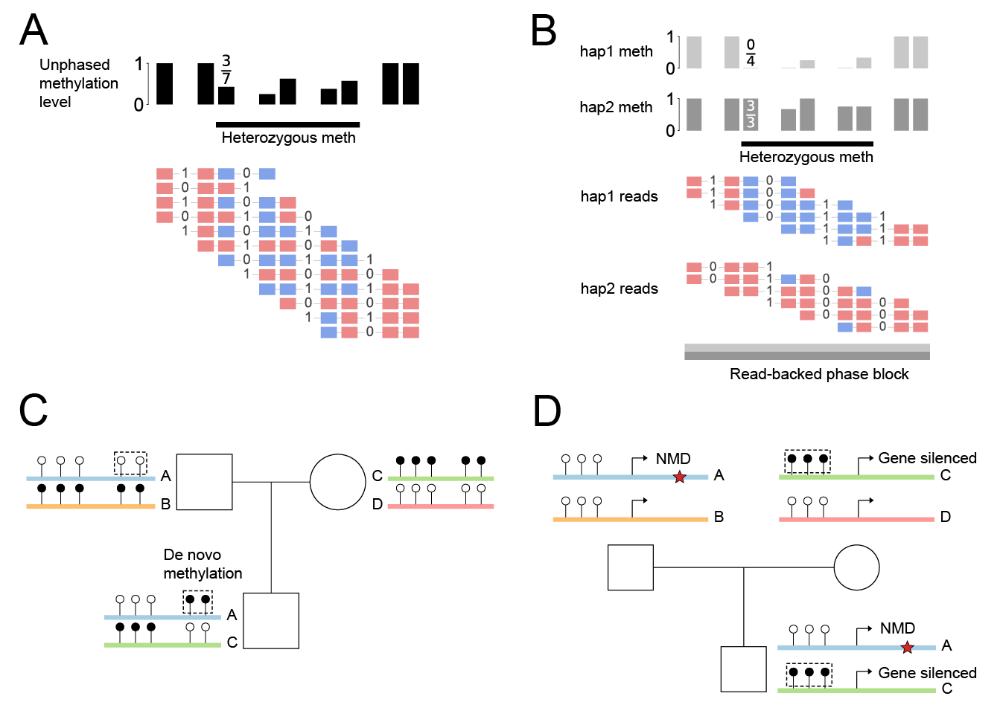

**Figure 1. Phasing CpG methylation resolves homolog-specific lesions.** **(A)** Single individual, before phasing. Reads carry a 0/1 glyph at SNV columns and red/blue boxes at methylated/unmethylated CpGs. The grey pooled-methylation track averages both haplotypes, hiding heterozygous methylation in an intermediate value (3/7, highlighted cluster). **(B)** Same reads, after phasing. SNV bits partition reads hap1-above-hap2 (read-backed phasing); the pooled track splits in two and heterozygous methylation resolves cleanly (0/4 vs. 3/3). The two-tone grey bar marks the read-backed phase block; founder identity (paternal vs. maternal) of hap1/hap2 is assigned downstream. **(C)** Maternal LOM at an imprinted locus in a trio. Homologs are drawn as coloured bars with methylation lollipops at CpGs (filled = methylated, open = unmethylated); founder haplotypes are labelled A/B (dad) and C/D (mom). The kid inherits A from dad and C from mom; C in the kid is unmethylated rather than methylated (dashed box) — a maternal LOM. **(D)** Compound genetic-epigenetic heterozygote in a trio. The kid inherits dad's hap A carrying a frameshift SNV (red star), and mom's hap C carrying a hyper-methylated promoter — two hits on opposite parental haplotypes that inactivate the gene in trans, while each parent is a silent carrier of one hit.
