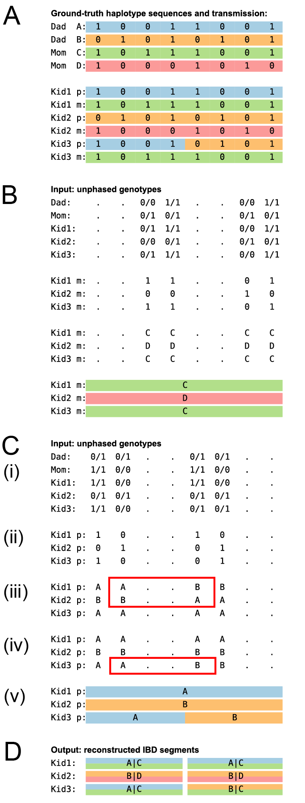

**Figure 2. Tracking the transmission of haplotypes in a nuclear family.** **(A)** Ground truth — the haplotype sequences of the four founders, the two phased homologs that each kid inherited, and the single paternal recombination that occurred during transmission. Panels B–D below take only the unphased VCF genotypes as input and reconstruct, end-to-end, both the per-kid haplotype assignments and the recombination event shown here; panel D should be read as a direct reconstruction of panel A. The four founder haplotypes (Dad A, Dad B, Mom C, Mom D) are drawn as 0/1 cells (0 = REF allele at an SNV, 1 = ALT allele), followed by each kid's two phased homologs (paternal "p" row above maternal "m" row), with every cell colored by the founder haplotype it was inherited from. Kid3's paternal row switches from A to B mid-locus, marking a paternal recombination. **(B)** Maternal-side reconstruction from unphased data. Top: the unphased VCF genotypes for all five individuals, restricted to mom-informative sites (sites where mom is heterozygous and dad is homozygous). Middle-top: the raw maternally inherited allele extracted at each informative site. For example, if dad is 0/0 while mom is 0/1, then any child that also carries a 1 (Kid1 and Kid3 in this example) must have inherited mom’s 1-carrying homolog. Middle-bottom: at each informative site, partition kids by parental homologs, assigning the letter “C” to the majority class and “D” to the minority class. Bottom: Runs of identical letters across sites are collapsed into a single maternal IBD (Identity-By-Descent) segment — a contiguous region across which each kid's maternal haplotype assignment is constant — that each kid inherited. Compare with the ground truth in panel A. **(C)** Paternal-side reconstruction. Top three tables (i - iii) mirror those in panel B, except restricted to dad-informative sites and labelled A/B (majority/minority allele at each site). The red rectangle highlights two putative crossovers that occur at the same locus in two independent meioses. Given the low likelihood of this event (≪1 crossover/Mb/meiosis), we swap labels among kids at the informative sites after the crossover location (thereby preserving the partitioning established at those sites), yielding the more likely scenario of a single crossover among the three kids (red rectangle in iv). The reconstruction in (v) collapses runs of identical letters across sites into per-kid paternal IBD segments — contiguous regions across which each kid's paternal haplotype assignment is constant — and shows Kid3's paternal row switching from A (blue) to B (orange) at the recombination breakpoint, recovering the ground truth shown in panel A. **(D)** Bilateral IBD segments. For each kid, the parent-specific IBD segments from panels B and C are intersected to form bilateral IBD segments: contiguous regions across which both the paternal and maternal haplotype assignments are constant. Each segment is drawn as a labelled rectangle whose top half is filled with the paternal-letter colour and bottom half with the maternal-letter colour, with the founder-haplotype pair (e.g. "A|C") centred. A colour change in either half of any kid's row marks a bilateral-segment boundary that is registered across all three kids, so Kid3's paternal recombination splits every row at the same locus into two adjacent rectangles of identical width — Kid3 transitions from "A|C" to "B|C" while Kid1 ("A|C") and Kid2 ("B|D") repeat their pair across both segments. Aligning the segment boundaries this way makes explicit that "IBD segment" denotes the same contiguous region for every kid, a convention reused without redefinition by Fig 3E. Panel D thereby recovers, from unphased VCF genotypes alone, the per-kid haplotype transmission and the paternal recombination drawn as ground truth in panel A. **Conventions used throughout the manuscript.** In any two-stripe block label, the pipe (`|`) separates the paternal founder (left) from the maternal founder (right); correspondingly, the top stripe of the rectangle is filled with the paternal founder's colour (A or B) and the bottom stripe with the maternal founder's colour (C or D). These conventions are reused, without redefinition, by Fig 4.
