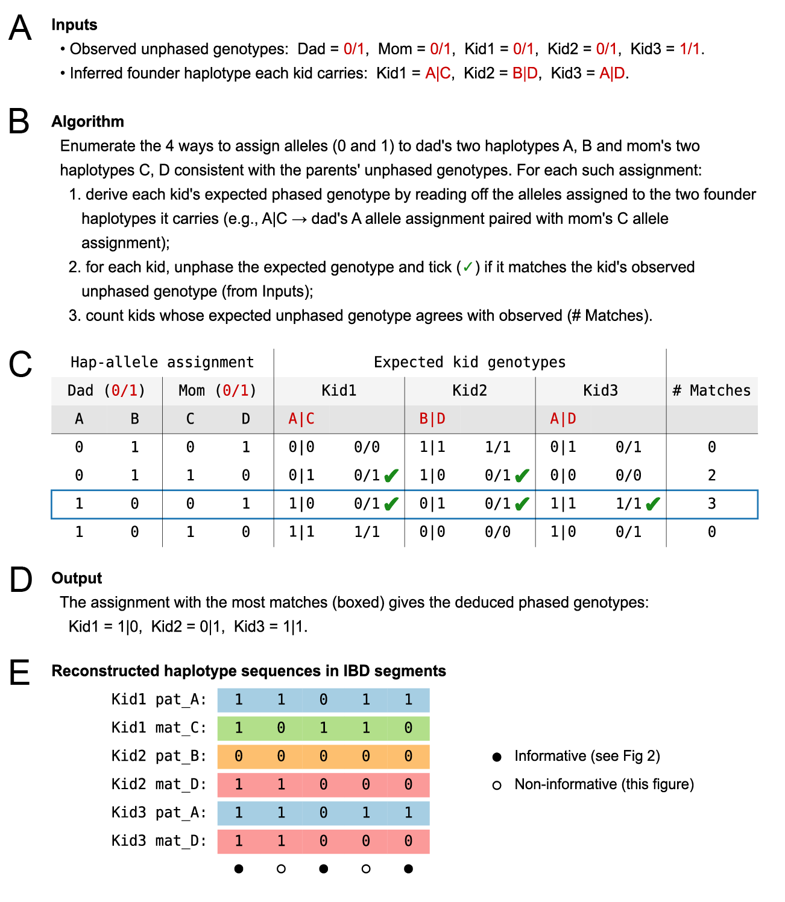

**Figure 3. Using IBD blocks to phase alleles at a non-informative site by exhaustive enumeration.** At a non-informative site (a site at which both parents are heterozygous, so the parental genotypes alone don't determine which allele lies on which parental haplotype), the site can still be phased within an IBD block (defined in Fig 2) by exhaustively enumerating every assignment of alleles (0 and 1) to the parental haplotypes — A, B for dad and C, D for mom — that is consistent with the parents' observed unphased genotypes (four such assignments at a non-informative site, since each parent is 0/1), and choosing the assignment that best explains the kids' observed unphased genotypes given each kid's phased founder-haplotype label (paternal letter | maternal letter), which is constant within the block and inferred upstream from informative sites. For each assignment we count the kids whose expected unphased genotype matches the observed (# Matches). The assignment with the most matches (boxed) gives the deduced phased genotypes for the kids. Algorithm inputs are coloured red.
