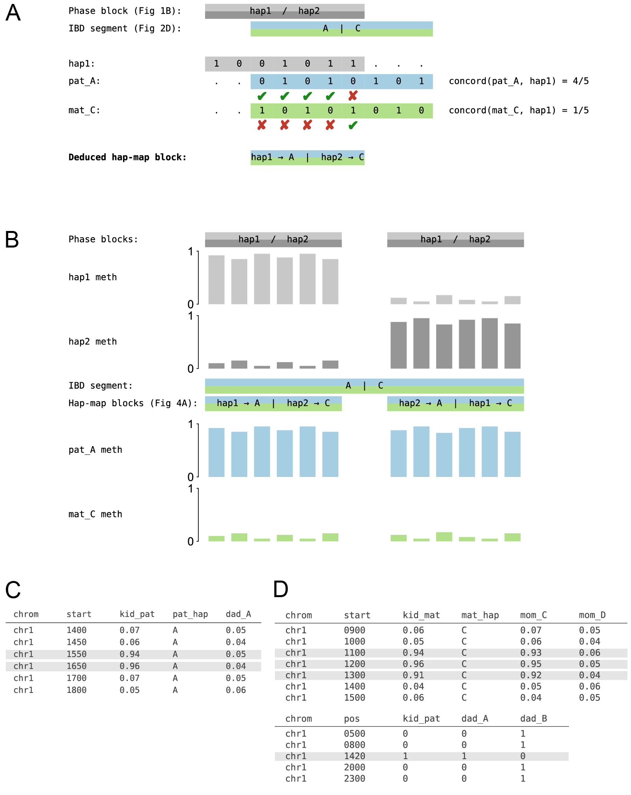

**Figure 4. Founder-phased methylation: relabel read-backed haplotypes by the founder they descend from, and how to use the output of tapestry to discover the scenarios in Fig 1C and D.** Two-stripe blocks throughout this figure follow Fig 2D's convention: the pipe (`|`) in a block label separates the paternal founder (left) from the maternal founder (right); the top stripe is filled with the paternal-side colour and the bottom stripe with the maternal-side colour. **(A)** Bit-vector matching assigns the arbitrary `hap1`/`hap2` labels of read-backed phasing to founder haplotypes within the *hap-map block* — the intersection of the two phasings of the locus — a *read-backed phase block* (in which `hap1` and `hap2` are defined contiguously by spanning reads but carry no founder identity) and a *transmission-based IBD segment* (in which one paternal founder, here `A`, and one maternal founder, here `C`, are constant; same vocabulary as Figs 2 and 3). Across the heterozygous sites inside the hap-map block we compare `hap1`'s bit-vector against the `pat_A` and `mat_C` bit-vectors; ticks mark per-site matches, and the two concordances (which sum to 1, since every site in the block is heterozygous) decide the labelling — here `hap1 → A`, `hap2 → C`. This deduced mapping is recorded as the label of the hap-map block, so the block carries both its geometric definition (RBP ∩ IBD) and the deduced hap1/hap2-to-founder correspondence inside it. **(B)** Rebucketing per-CpG methylation by founder. Within a single IBD segment (founder pair `A | C`) the locus is spanned by *two* read-backed phase blocks. Each phase block carries an internally consistent hap1/hap2 partitioning, but the hap1/hap2 *labels* are independent across phase blocks — so which of `hap1` / `hap2` carries the A-bearing reads can flip from one phase block to the next, as panel A reveals. The two hap-map blocks (RBP ∩ IBD) make this flip explicit: in the first, `hap1 → A` (paternal founder is read-backed-phasing's hap1); in the second, `hap2 → A` (paternal founder is read-backed-phasing's hap2). The top two tracks (`hap1 meth`, `hap2 meth`) plot the per-CpG methylation values computed per read-backed haplotype as in Fig 1B; because the hap1/hap2 ↔ founder mapping flips, the visible methylation pattern flips too — neither track on its own represents a single founder, and the apparent flip between blocks reflects only the relabelling of read partitions, not any biological change in methylation. The bottom two tracks (`pat_A meth`, `mat_C meth`) plot the *same* methylation values, *relabelled* (not recomputed) per hap-map block: bars from the `hap1` / `hap2` identified with `A` are routed to `pat_A meth`, and bars from the `hap1` / `hap2` identified with `C` are routed to `mat_C meth`. The result is that the true heterozygous methylation pattern of the locus — `A` hypermethylated and `C` hypomethylated, consistently across both phase blocks — is recovered, whereas the unrebucketed top view buries it inside the hap1/hap2 flip. **(C)** Discovering the de novo gain-of-methylation scenario of Fig 1C from tapestry's founder-phased methylation output: querying for CpGs at which a kid's methylation on one founder rises sharply above the level seen on the same founder in the transmitting parent surfaces the discovery as a contiguous run of rows (highlighted) within a baseline window. **(D)** Discovering the compound genetic-epigenetic heterozygote scenario of Fig 1D from tapestry's output by joining the founder-phased methylation table (top) with founder-phased genotypes (bottom): kids carrying a deleterious variant on one founder and a methylation-driven silencing event on the other founder are surfaced as the highlighted rows, with each lesion traced to the parent of origin via the founder labels.
