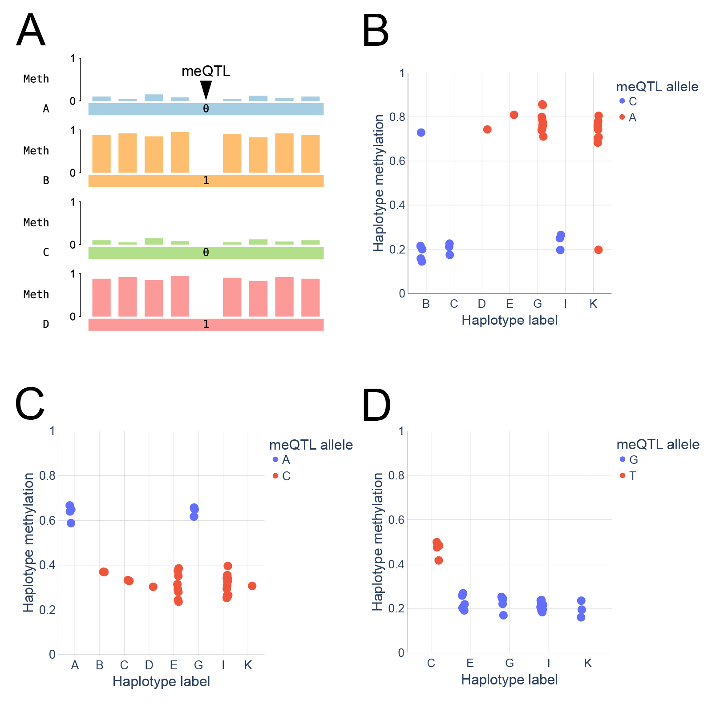

**Figure 5. Correlation between methylation and founder haplotypes at known meQTLs (methylation QTLs) in pedigree K1463 validates tapestry's founder-phasing method.** 

**(A)** Illustration of how the allele at a meQTL covaries with phased methylation, as a function of host haplotype, across two parents. If tapestry correctly assigns methylation to founder haplotypes across all descendents of these parents, then it ought to recover these allele-methylation correlations. 

**(B)** Rosenski et al. 2025 ([doi:10.1038/s41467-025-57433-1](https://doi.org/10.1038/s41467-025-57433-1)) report that the allele at rs9330298 covaries with local methylation. In particular, they found that haplotypes carrying the C allele at that SNP are unmethylated while those carrying the A allele are methylated. Consistent with this, we show that methylation across the pedigree K1463, phased by tapestry and averaged over a small interval containing this SNP (chr1:153617695-153617953, hg38), does indeed covary with the founder haplotypes that tapestry assigns, when they are grouped by the allele at the SNP. 

**(C)** In another study, Rosenski et al. 2025 ([doi:10.1101/2025.09.15.675351](https://doi.org/10.1101/2025.09.15.675351)) report that the allele at rs12499263 covaries with local methylation. They showed that haplotypes harboring the C (A) allele tend to have low (high) methylation, because the A allele disrupts DNA-binding of a transcription factor (CTCF) known to be required for protection from de novo methylation. The predicted correlation between the SNP and the methylation local to it is recovered by tapestry in pedigree K1463 when we average phased methylation over an interval (chr4:184100296-184100698; hg38) containing the SNP. 

**(D)** Rosenski et al. 2025 ([doi:10.1101/2025.09.15.675351](https://doi.org/10.1101/2025.09.15.675351)) also showed that allelic variation at SNP rs12636296 correlates with methylation at a CpG island at the ALG1L promoter (G allele unmethylated and T allele methylated), and consequently expression of the gene. Tapestry recovers this association between the SNP and founder-phased methylation (averaged over an interval containing the CpG island and the SNP; chr3:125990135-125991474; hg38) in the pedigree K1463. 

