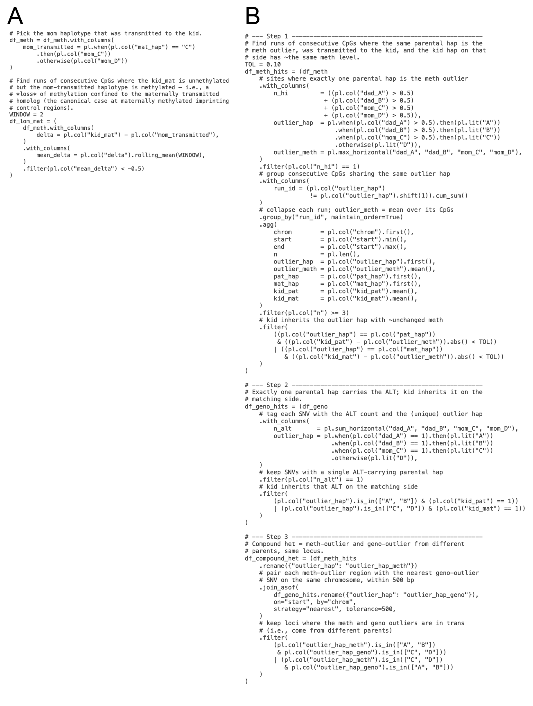

**Supporting Figure 1. Polars discovery snippets against tapestry's per-CpG BED, with one column per parental haplotype (`dad_A`, `dad_B`, `mom_C`, `mom_D`), the kid's per-side values (`kid_pat`, `kid_mat`), and founder labels (`pat_hap`, `mat_hap`).** **(A)** Maternal LOM (cf. Fig 1C, Fig 4C). Mirroring the column choice to the paternal side surfaces the paternal LOM case; flipping the sign surfaces a homolog-specific *gain* of methylation on either side. **(B)** Compound genetic-epigenetic heterozygote (cf. Fig 1D, Fig 4D), as a three-step chain: methylation outlier (Step 1), ALT-carrying genotype outlier with the analogous inheritance check (Step 2), inner-join restricted to in-trans hits (Step 3).
