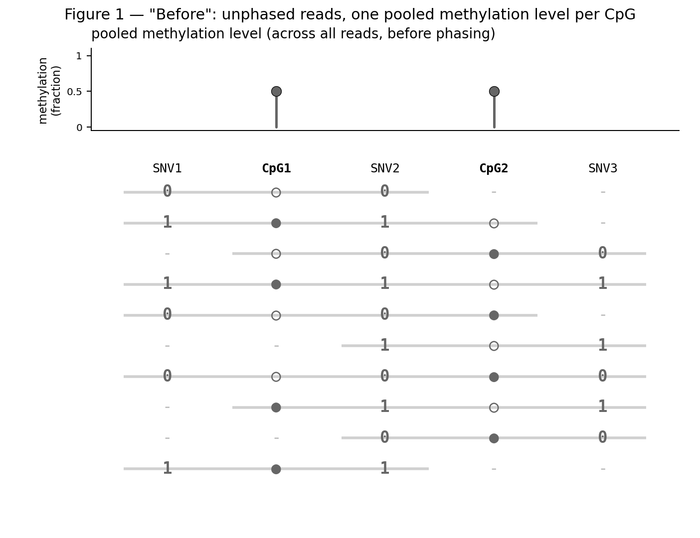
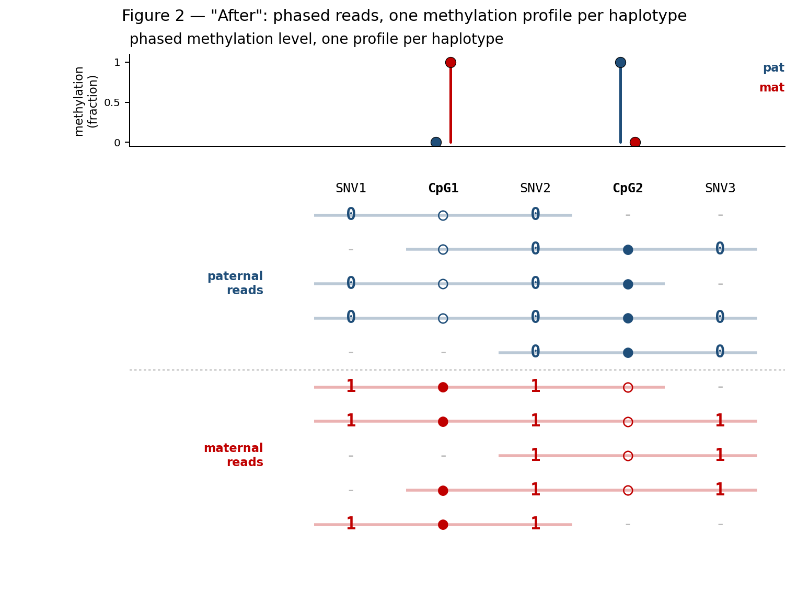
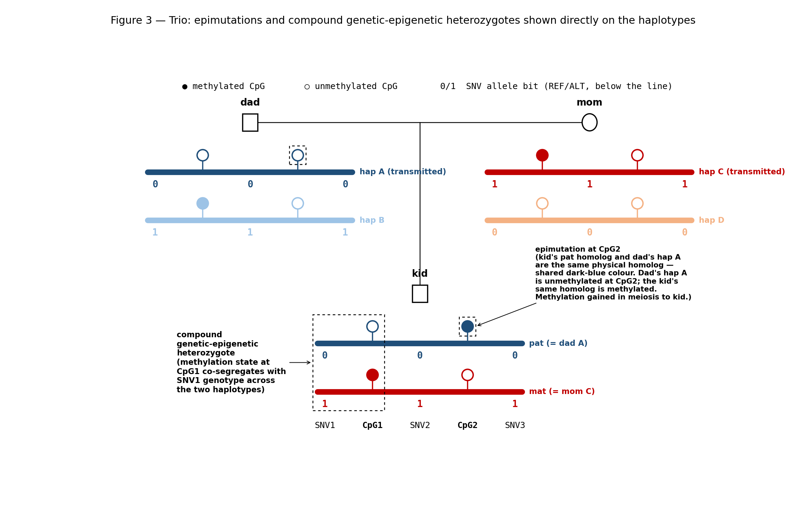

# Why phase DNA methylation?

This page is part of the [tapestry wiki](../index.md). It motivates
the rest of the wiki by answering one question: *why is it worth
phasing per-CpG methylation onto each haplotype, instead of leaving it
as a single number per CpG?* Three cartoon figures build the answer
on a small synthetic locus: the first two take a single individual
through a before/after of phasing to show what the read partition does
to the methylation profile, and the third places that individual into a
trio so the two flagship use cases — *epimutations* and *compound
genetic-epigenetic heterozygotes* — fall out directly.

The motivation does not depend on which phasing strategy gets you to
parental-haplotype resolution, so this page is shared between
tapestry's [pedigree-wise](../pedigree_wise_workflow/index.md) and
[trio-wise](../trio_wise_workflow/README.md) workflows.

## Definitions

- **Epimutation** — a change in the methylation state of a specific
  physical homolog across a single meiosis. Detectable only when a
  parent and child can be compared on the *same* haplotype, which in
  turn requires phased methylation.
- **Compound genetic-epigenetic heterozygote** — an individual who is
  simultaneously heterozygous at a SNV *and* heterozygous in
  methylation state at a nearby CpG, with the methylation state
  tracking the SNV genotype across the two haplotypes. Invisible to
  either an unphased genotype call or an unphased methylation call,
  but trivial to read off the paired phased tracks.

## Figure 1 — before phasing (single individual)

A small synthetic locus with three SNVs and two CpGs in left-to-right
order: `SNV1`, `CpG1`, `SNV2`, `CpG2`, `SNV3`. Ten long reads span
parts of the locus; each read is annotated at the sites it covers
with a `0` or `1` at each SNV (REF/ALT bit, matching the convention
used throughout the wiki and in the vendored
[`inheritance_mapping/`](../pedigree_wise_workflow/inheritance_mapping/README.md)
section) and a filled (`●`) or open (`○`) circle at each CpG. Sites
outside a read's covered window appear as `-` to convey "no
information at this position".

Above the pile-up, the pooled methylation profile reports the fraction
of reads methylated at each CpG, on a 0–1 scale. Both CpGs come out at
exactly 0.5 — the least-informative possible value. A 0.5 per-CpG
number is consistent with many biological truths (both haplotypes at
50 %; one fully methylated and the other unmethylated; asymmetric
methylation between maternal and paternal homologs) and the unphased
pile-up cannot distinguish them.

## Figure 2 — after phasing (same individual)

The same ten reads, now partitioned by haplotype. The SNV bits
themselves carry the partition — every paternal read agrees on `(0, 0,
0)` at the three SNVs, every maternal read agrees on `(1, 1, 1)` — so
the partition is robust to a single sequencing error anywhere. With
the partition in hand, the pooled profile splits into two
per-haplotype profiles, drawn on the same 0–1 axis: paternal CpG1 = 0,
maternal CpG1 = 1, paternal CpG2 = 1, maternal CpG2 = 0. Each Figure 1
bar was hiding a maximally-far-apart pair of per-haplotype values, and
the two CpGs point in *opposite* directions — an unphased aggregate
erases both.

What Figure 2 shows is what tapestry computes, mechanically, for every
CpG once the haplotype partition is in hand. The two payoffs of having
those per-haplotype profiles only become visible once the individual
is placed into a pedigree, which is what Figure 3 does.

## Figure 3 — trio: epimutations and compound genetic-epigenetic heterozygotes

The same kid, now in a trio. Each individual is drawn with their two
haplotypes as horizontal coloured lines; allele bits sit on the line
at SNV positions and methylation lollipops sit above the line at CpG
positions (filled = methylated, open = unmethylated). The four founder
haplotypes get four distinct colours; the kid's two haplotypes inherit
the colour of the parental homolog they descend from, so a reader can
trace a single physical homolog by colour from parent to child.

Two phenomena fall out of this picture, both annotated in the figure:

- **Epimutation at CpG2.** Dad's transmitted homolog (hap A) is
  unmethylated at CpG2, but the kid's paternal homolog — the *same
  physical homolog* — is methylated at CpG2. This is a de novo gain of
  methylation in the meiosis from dad to kid, and is what tapestry
  flags as an epimutation. It is invisible without phasing because the
  kid's pooled CpG2 level (0.5) doesn't distinguish "kid pat
  methylated, kid mat unmethylated" from any other 50/50 mixture, and
  it is invisible without parent-vs-child comparison on the *same*
  homolog because dad's pooled CpG2 level (0) only tells you that one
  of dad's homologs is unmethylated at CpG2 there.
- **Compound genetic-epigenetic heterozygote at CpG1.** The kid is
  heterozygous at SNV1 (paternal allele 0, maternal allele 1) and the
  methylation state at the immediately-adjacent CpG1 co-segregates
  with the SNV1 genotype (paternal = ○, maternal = ●). The dashed
  rectangle around SNV1 + CpG1 in the kid marks the joint phenomenon.
  This class of variant is invisible to either an unphased genotype
  call or an unphased methylation call, but trivial to read off the
  paired phased tracks.

## What's next

The rest of the wiki is concerned with how tapestry actually performs
the phasing summarised in Figures 2 and 3:

- The [pedigree-wise workflow](../pedigree_wise_workflow/index.md)
  combines hiphase's read-backed phasing with `gtg-ped-map` /
  `gtg-concordance`'s inheritance-based phasing across a full
  pedigree, labelling each measurement with a founder haplotype.
- The [trio-wise workflow](../trio_wise_workflow/README.md) uses
  whatshap / pedMEC trio phasing to label each measurement with one
  of the parents' haplotypes — an option for the trio-only setting.

For a worked example of how to query tapestry's output for the two
phenomena above (epimutations, compound genetic-epigenetic
heterozygotes), see
[`trio_wise_workflow/output_format_trio/output_format_trio.md`](../trio_wise_workflow/output_format_trio/output_format_trio.md).
