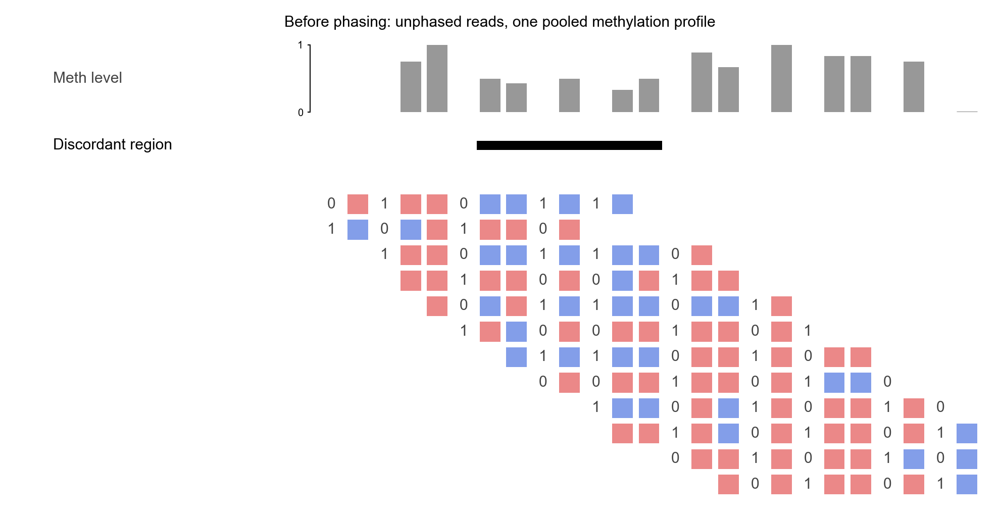
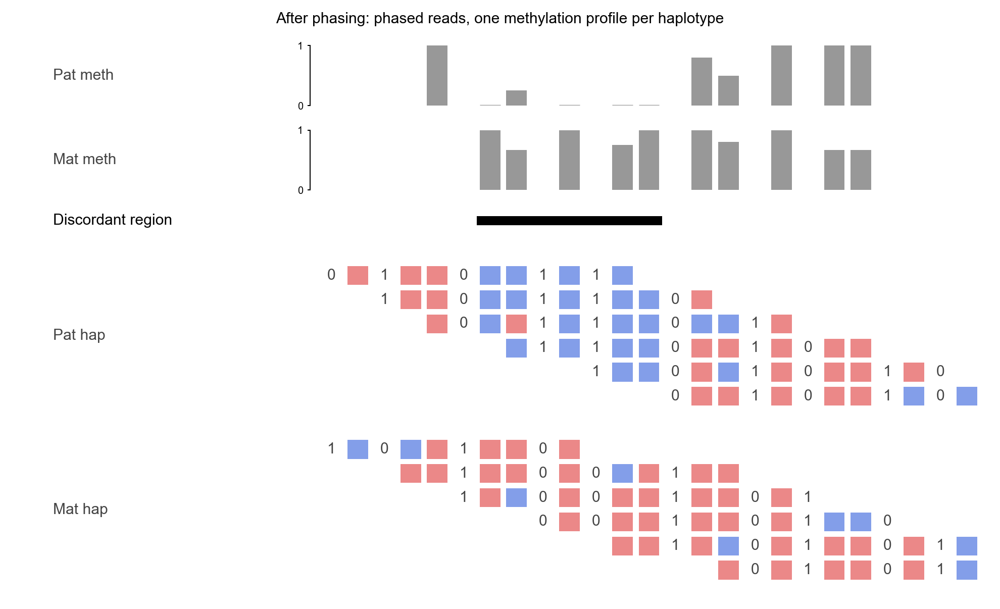
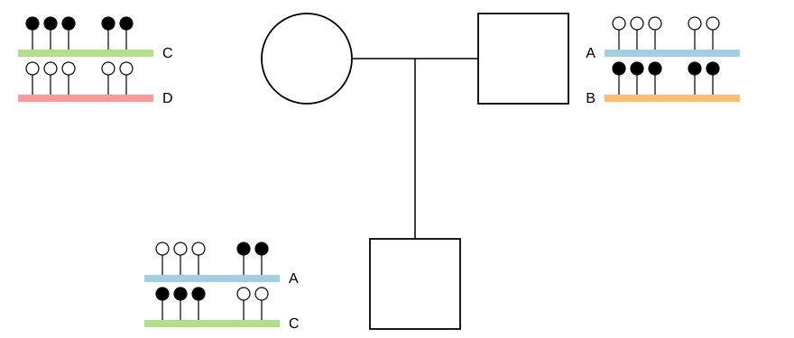
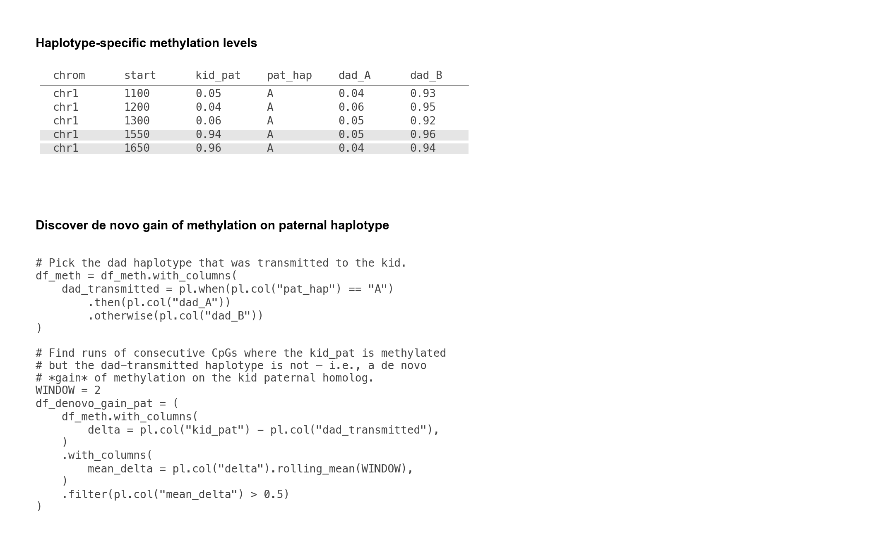
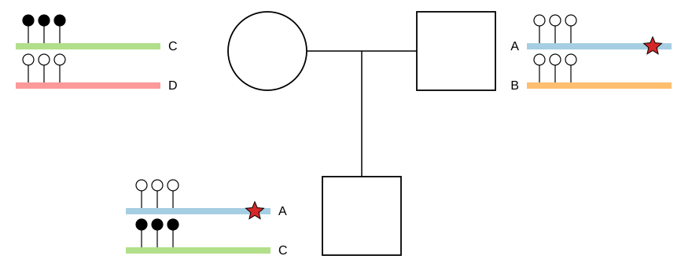
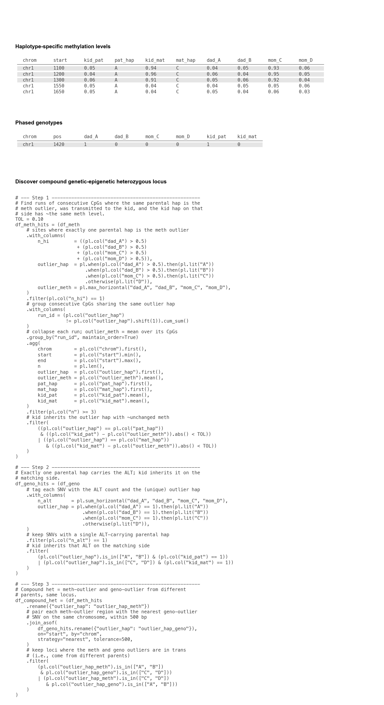

# Why phase DNA methylation?

This page is part of the [tapestry wiki](../README.md). It motivates
the rest of the wiki by answering one question: *why is it worth
phasing per-CpG methylation onto each haplotype, instead of leaving it
as a single number per CpG?* Two pairs of cartoon figures build the
answer on a small synthetic locus: the first pair takes a single
individual through a before/after of phasing to show what the read
partition does to the methylation profile; the second pair places that
individual into a trio so the two flagship use cases — *de novo
epimutations* and *compound genetic-epigenetic heterozygotes* — fall
out directly, together with the polars query a user runs against
tapestry's BED output to surface each one.

## Definitions

- **De novo epimutation** — a change in the methylation state of a
  specific physical homolog across a single meiosis. Detectable only
  when a parent and child can be compared on the *same* haplotype,
  which in turn requires phased methylation.
- **Compound genetic-epigenetic heterozygote** — an individual who
  inherits two different parental haplotypes such that one carries a
  genetic variant and the other carries an aberrant methylation state
  in *trans*. Invisible to either an unphased genotype call or an
  unphased methylation call, but detectable directly from per-haplotype
  tracks plus a trio.

## Single individual: before vs. after phasing

A small synthetic locus with mixed SNVs and CpGs. Ten ragged reads
cover overlapping windows; each read is one monospace row carrying a
`0`/`1` glyph at SNV columns and a small **red** (unmethylated) /
**blue** (methylated) box at CpG columns. Above the pile-up, a single
gray bigwig-style methylation track reports the *pooled* per-CpG
methylation level. With reads unpartitioned, the two haplotypes'
methylation states get averaged into one number per CpG — so per-CpG
heterozygous methylation is hidden inside an intermediate value.

The same ten reads, now partitioned by haplotype: rows are grouped
paternal-above-maternal (one `Pat hap` / `Mat hap` label per group on
the left) and the SNV bits themselves carry the partition. With the
partition in hand, the pooled profile splits into two stacked
per-haplotype bigwig tracks. What Figure 2 shows is what tapestry computes mechanically for
every CpG once the haplotype partition is in hand. The two payoffs of
having those per-haplotype profiles only become visible once the
individual is placed into a pedigree.

## Trio use case 1: de novo epimutation

The kid, now in a trio. Each individual carries two haplotypes drawn
as horizontal coloured bars; each bar is decorated with methylation
lollipops at CpG positions (filled = methylated, open = unmethylated).
At the right CpG cluster, two de novo events sit on opposite
parental haplotypes. The kid's paternal homolog (`A`, inherited from
dad) is methylated there, but dad's same physical homolog is
unmethylated — a de novo *gain* of methylation. Symmetrically, the
kid's maternal homolog (`C`, inherited from mom) is unmethylated at
the same cluster, but mom's same physical homolog is methylated — a
de novo *loss*. The left cluster is concordant on both sides
(unmethylated on `A` from dad to kid; methylated on `C` from mom to
kid).

Once tapestry produces a per-CpG haplotype-resolved BED, surfacing
de novo epimutations is a one-pass polars filter: pick the dad
haplotype that was transmitted to the kid (using the `pat_hap` phasing
column), then keep CpGs where `kid_pat` methylation diverges, on
average over a small window, from the dad-transmitted haplotype.

## Trio use case 2: compound genetic-epigenetic heterozygote

Same trio, different scenario: the kid inherits **dad's hap A** —
which carries a SNV variant (red star) — *and* **mom's hap C** —
which carries an aberrantly hyper-methylated promoter region (filled
lollipops at the leftmost three CpGs). The two hits sit on opposite
parental haplotypes, so the kid is a compound genetic-epigenetic
heterozygote *in trans* — silenced on the maternal allele by aberrant
methylation, broken on the paternal allele by a coding variant. Each
parent is a silent carrier of one of the two hits.

Discovery from tapestry's BED is again a polars chain over two
inputs: a per-CpG methylation table and a per-SNV genotype table,
both with one column per parental haplotype (`dad_A`, `dad_B`,
`mom_C`, `mom_D`) plus the kid's per-side phased values
(`kid_pat`, `kid_mat`) and the phasing labels (`pat_hap`, `mat_hap`).
Step 1 finds methylation-outlier regions where exactly one parental
hap is the outlier and the kid inherits that hap with ~unchanged
meth. Step 2 finds genotype-outlier SNVs with the analogous
inheritance check. Step 3 joins the two and keeps loci where the
meth-outlier and geno-outlier come from *different* parents — i.e.,
the two hits are in trans.

## What's next

The rest of the wiki is concerned with how tapestry actually performs
the phasing summarised above:

- The [pedigree-wise workflow](../pedigree_wise_workflow/index.md)
  combines hiphase's read-backed phasing with `gtg-ped-map` /
  `gtg-concordance`'s inheritance-based phasing across a full
  pedigree, labelling each measurement with a founder haplotype.
- The [trio-wise workflow](../trio_wise_workflow/index.md) uses
  whatshap / pedMEC trio phasing to label each measurement with one
  of the parents' haplotypes — an option for the trio-only setting.
