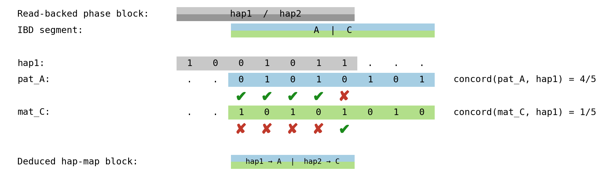

# Founder-phased methylation (Step 3)

This page is part of the
[pedigree-wise workflow](../index.md). It covers Step 3 of the
pipeline — `phase_meth_to_founder_haps.py` and `hap_map_pedigree.py` —
which is the conceptual centre of tapestry. Step 3 takes the two
phasings produced upstream and uses them to relabel each per-CpG
methylation measurement with one of the four founder homologs of
the pedigree.

## The two phasings, and where they meet

Two independent phasings reach Step 3:

- **Read-backed phasing** (Step 1A, hiphase). Within each *phase
  block*, hiphase emits two anonymous read partitions, `hap1` and
  `hap2`, and writes the partition into the BAM (`HP`/`PS` tags).
  Inside a block the two partitions are linked across heterozygous
  sites; across blocks the partition labels are independent.
- **Inheritance-based phasing** (Step 1B, `gtg-ped-map` +
  `gtg-concordance`). Within each *linkage block*,
  inheritance-based phasing reaches Step 3 as two parallel data
  structures:
  - The **iht-phased VCF**, which phases each het variant as `p|m`
    where `p` is the allele on the paternal homolog and `m` the
    allele on the maternal homolog. Tapestry parses this in
    [`get_iht_phasing`](https://github.com/quinlan-lab/tapestry/blob/c3e8a2e22ecba4dc4f696493eae8e6a8665c59c9/src/phasing_pedigree.py#L99)
    (called from
    [`phase_meth_to_founder_haps.py:29`](https://github.com/quinlan-lab/tapestry/blob/c3e8a2e22ecba4dc4f696493eae8e6a8665c59c9/src/phase_meth_to_founder_haps.py#L29)).
  - The **iht-blocks table** ([`df_iht_blocks`](https://github.com/quinlan-lab/tapestry/blob/c3e8a2e22ecba4dc4f696493eae8e6a8665c59c9/src/phase_meth_to_founder_haps.py#L32)), which assigns one of the pedigree's
    *founder-haplotype letters* to the paternal and maternal slot in
    each block. The founders of the pedigree are the individuals at
    its root — for the CEPH1463 pedigree, the four great-grandparents
    — and `gtg-ped-map` labels their eight homologs with letters
    `A`, `B`, `C`, `D`, `E`, `F`, `G`, `H`. The kid's paternal and
    maternal homologs in each linkage block are therefore labelled
    with one of *those* root-founder letters, not with letters tied
    to dad and mom (unless the parents themselves happen to be
    founders, as in a strict nuclear-family setting). Within a block
    the assignment is fixed; across blocks it is not. Each linkage
    block is bounded by a crossover event in a transmitting
    ancestor — for example, a crossover on the paternal transmission
    path swaps the founder letter carried in the kid's paternal slot
    from one block to the next. Tapestry parses this in
    [`get_iht_blocks`](https://github.com/quinlan-lab/tapestry/blob/c3e8a2e22ecba4dc4f696493eae8e6a8665c59c9/src/phasing_pedigree.py#L153)
    (called from
    [`phase_meth_to_founder_haps.py:32`](https://github.com/quinlan-lab/tapestry/blob/c3e8a2e22ecba4dc4f696493eae8e6a8665c59c9/src/phase_meth_to_founder_haps.py#L32)).

The two block partitions of the genome do not align. The natural
unit on which to relate them is the **hap-map block**: the
intersection of one read-backed phase block with one linkage block.
Inside such an intersection the read partition is consistent and
the founder labels are fixed, so a single decision relates one to
the other.

## Bit-vector match

Inside one hap-map block, each het SNV contributes one bit to three
parallel vectors:

- `hap1` — the read-partition allele on hiphase's `hap1` side.
- `pat` — the allele on the paternal founder homolog.
- `mat` — the allele on the maternal founder homolog.

`hap1` is compared against `pat` and `mat` in turn. Since every
contributing site is heterozygous, `pat` and `mat` carry opposite
alleles at each site; consequently the per-site match is mutually
exclusive, and `concordance(hap1, pat) + concordance(hap1, mat) = 1`
exactly. The decision is a single threshold:

- If `concordance(hap1, pat) > 0.5` → hiphase's `hap1` reads descend
  from the paternal founder homolog (and `hap2` reads from the
  maternal one).
- Otherwise → the assignment is flipped.

This decision is made once per hap-map block; the relevant code is
the bit-vector comparison in [`get_hap_map`](https://github.com/quinlan-lab/tapestry/blob/c3e8a2e22ecba4dc4f696493eae8e6a8665c59c9/src/hap_map_pedigree.py#L13),
specifically the `similarity_hap1_pat > 0.5` branch at
[line 58](https://github.com/quinlan-lab/tapestry/blob/c3e8a2e22ecba4dc4f696493eae8e6a8665c59c9/src/hap_map_pedigree.py#L58); the
function is called from
[`phase_meth_to_founder_haps.py:208`](https://github.com/quinlan-lab/tapestry/blob/c3e8a2e22ecba4dc4f696493eae8e6a8665c59c9/src/phase_meth_to_founder_haps.py#L208).

## Mechanical re-bucketing of methylation

Once each haplotagged read carries a founder tag, the per-CpG
methylation summaries split mechanically. Reads bucketed under the
HP tag's `hap1` and `hap2` files are re-emitted as `pat` and `mat`
files (or vice versa) according to the decision above; per-CpG
methylation levels follow the bucket rather than being recomputed.
The assembly is performed in
[`phase_meth_to_founder_haps`](https://github.com/quinlan-lab/tapestry/blob/c3e8a2e22ecba4dc4f696493eae8e6a8665c59c9/src/phase_meth_to_founder_haps.py#L44)
(called once per pb-CpG-tools mode at
[line 236](https://github.com/quinlan-lab/tapestry/blob/c3e8a2e22ecba4dc4f696493eae8e6a8665c59c9/src/phase_meth_to_founder_haps.py#L236)
and
[line 238](https://github.com/quinlan-lab/tapestry/blob/c3e8a2e22ecba4dc4f696493eae8e6a8665c59c9/src/phase_meth_to_founder_haps.py#L238)).

## Mismatch sites and Step 4 QC

Most hap-map blocks have a small number of sites where `hap1`
disagrees with the chosen parental vector — concordance < 1. Those
sites are recorded alongside the hap-map block and propagated to
Step 4 ([all-CpG expansion](../all_cpg_expansion/all_cpg_expansion.md)),
where every CpG within 50 bp of one of them is annotated with the
`cpg_is_within_50bp_of_mismatch_site` QC flag in tapestry's BED
output. Downstream consumers can choose whether to keep or filter
those CpGs.
