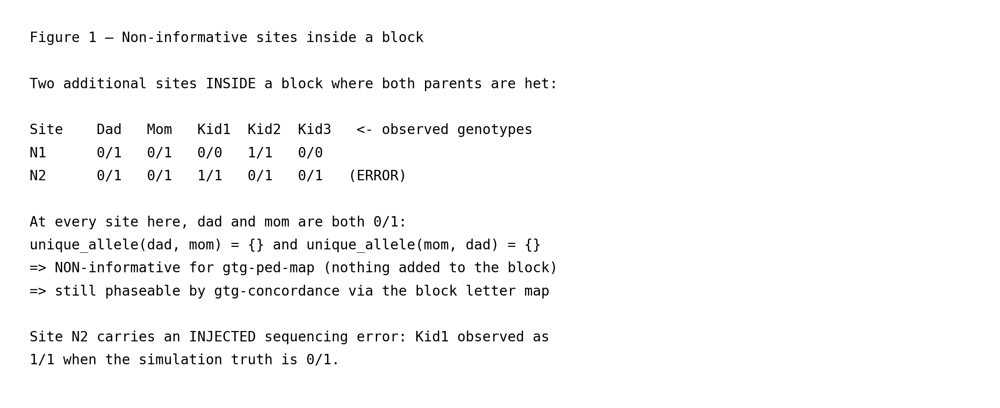
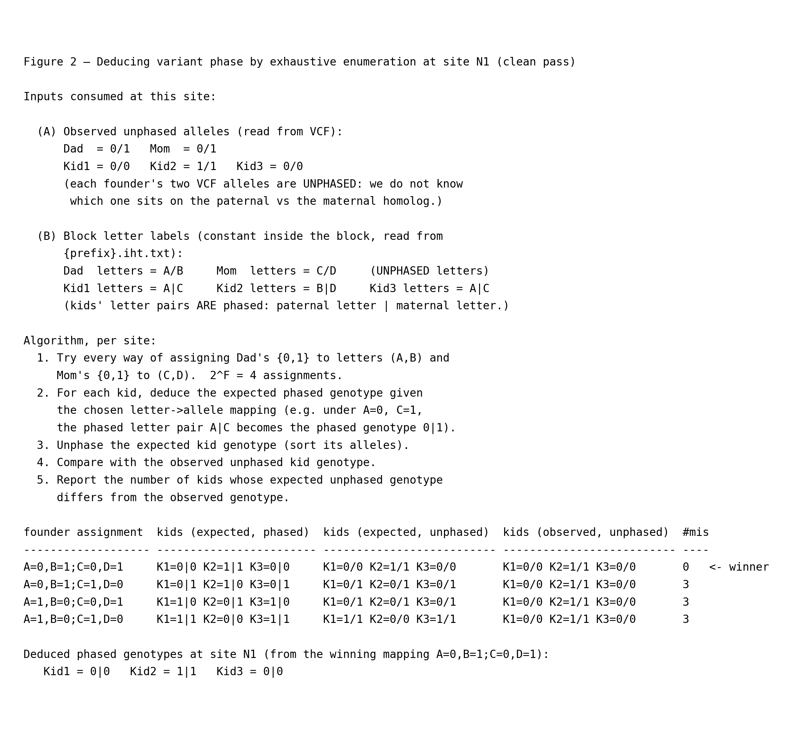
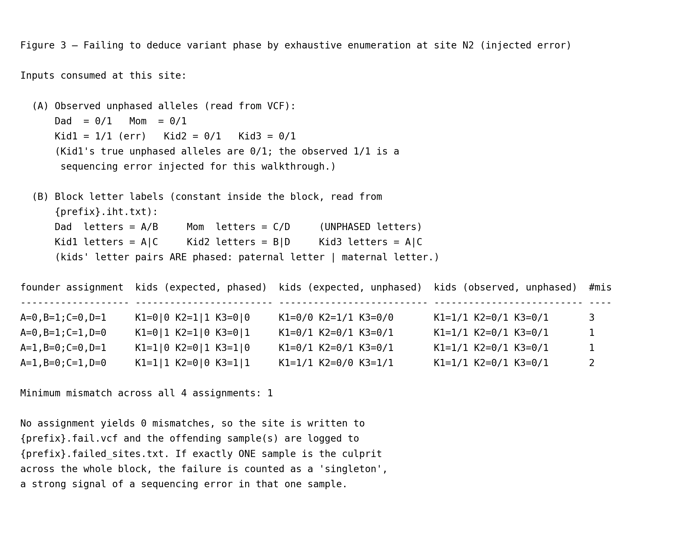

# Phasing alleles consistently with the haplotype map

This page is part of the [wiki](../../../README.md) and picks up where the
[nuclear-family walkthrough](../nuclear_family/nuclear_family.md) left
off. `gtg-ped-map` emits only founder letters, and only at informative
sites; it never reconstructs the 0/1 allele sequence of any haplotype.
That job belongs to `gtg-concordance`, which re-reads the VCF for each
IHT block and phases **every** variant using the block's letter map.
All line numbers refer to commit `7bb9f88`. As in the other
walkthrough pages, each function link is followed by its call site in
the driver — `main()` in
[`gtg_concordance.rs`](https://github.com/Platinum-Pedigree-Consortium/Platinum-Pedigree-Inheritance/blob/7bb9f882dc0956934f6b4979fd69c04d84b56e98/code/rust/src/bin/gtg_concordance.rs#L315) — so you can step through
the driver source in parallel with this walkthrough.

The toy simulation reuses the [left half of the nuclear-family block](https://github.com/petermchale/Platinum-Pedigree-Inheritance/blob/main/wiki/nuclear_family/fig4_2.png)
(Kid1=(A,C), Kid2=(B,D), Kid3=(A,C)) and adds two sites where both
parents are heterozygous. These are NON-informative for `gtg-ped-map`
because [`unique_allele`](https://github.com/Platinum-Pedigree-Consortium/Platinum-Pedigree-Inheritance/blob/7bb9f882dc0956934f6b4979fd69c04d84b56e98/code/rust/src/bin/map_builder.rs#L243) returns `None` at each
of them, but `gtg-concordance` still has to phase them. One of the two
sites carries an injected sequencing error so both the clean-pass
(`pass.vcf`) and error-quarantine (`fail.vcf`) code paths are
exercised. Everything below is reproducible by running

```
python wiki/generate_wiki.py --page concordance
```

which regenerates both the figure PNGs referenced here and this
markdown file itself.

## 1. Ingesting inheritance blocks and their variants

The driver reads the `{prefix}.iht.txt` file produced by
`gtg-ped-map` using
[`parse_ihtv2_file`](https://github.com/Platinum-Pedigree-Consortium/Platinum-Pedigree-Inheritance/blob/7bb9f882dc0956934f6b4979fd69c04d84b56e98/code/rust/src/iht.rs#L606) (driver call at
[`gtg_concordance.rs:405`](https://github.com/Platinum-Pedigree-Consortium/Platinum-Pedigree-Inheritance/blob/7bb9f882dc0956934f6b4979fd69c04d84b56e98/code/rust/src/bin/gtg_concordance.rs#L405)). The parser walks
the file line by line: the first three whitespace-separated fields of
each row are the `chrom`, `start`, and `end` of the block's BED
interval, the trailing columns carry the per-block marker count, and
the middle columns — one per individual, in the header order — hold
the two letter labels separated by `|` or `/`. Using `founder_count`
(taken from the pedigree) as the split point, the first chunk of
individuals is stored in the block's `founders` map and the rest in
its `children` map, so every block ends up as an `IhtVec { bed,
iht: Iht { founders, children }, count }` entry. Inside this block
the letters are constant; the concrete labels used by the toy
simulation appear in the "Block letter labels" panel of Figure 2.

The driver then iterates over the returned `Vec<IhtVec>` one block at
a time. For each block it converts the BED coordinates to the
`(chrom_id, start, end)` triple expected by `rust-htslib` and calls
`reader.fetch(...)` at
[`gtg_concordance.rs:427`](https://github.com/Platinum-Pedigree-Consortium/Platinum-Pedigree-Inheritance/blob/7bb9f882dc0956934f6b4979fd69c04d84b56e98/code/rust/src/bin/gtg_concordance.rs#L427) to position the VCF
reader on the first record that falls inside the block — silently
skipping the block if the fetch fails (e.g. the contig is absent from
the VCF index). Every record returned by the resulting
`reader.records()` iterator is fed through
[`parse_vcf_record`](https://github.com/Platinum-Pedigree-Consortium/Platinum-Pedigree-Inheritance/blob/7bb9f882dc0956934f6b4979fd69c04d84b56e98/code/rust/src/bin/gtg_concordance.rs#L116) at
[`gtg_concordance.rs:440`](https://github.com/Platinum-Pedigree-Consortium/Platinum-Pedigree-Inheritance/blob/7bb9f882dc0956934f6b4979fd69c04d84b56e98/code/rust/src/bin/gtg_concordance.rs#L440), which pulls each
sample's depth and (unphased, index-sorted) allele vector into a
`HashMap<String, (depth, Vec<GenotypeAllele>)>`. Low-quality records
(`record.qual() < args.qual`) and records with missing alleles are
short-circuited straight to `{prefix}.fail.vcf` at
[`gtg_concordance.rs:444`](https://github.com/Platinum-Pedigree-Consortium/Platinum-Pedigree-Inheritance/blob/7bb9f882dc0956934f6b4979fd69c04d84b56e98/code/rust/src/bin/gtg_concordance.rs#L444) and
[`gtg_concordance.rs:450`](https://github.com/Platinum-Pedigree-Consortium/Platinum-Pedigree-Inheritance/blob/7bb9f882dc0956934f6b4979fd69c04d84b56e98/code/rust/src/bin/gtg_concordance.rs#L450); everything else is
handed to the per-site phasing step —
[`find_best_phase_orientation`](https://github.com/Platinum-Pedigree-Consortium/Platinum-Pedigree-Inheritance/blob/7bb9f882dc0956934f6b4979fd69c04d84b56e98/code/rust/src/bin/gtg_concordance.rs#L252) at
[`gtg_concordance.rs:454`](https://github.com/Platinum-Pedigree-Consortium/Platinum-Pedigree-Inheritance/blob/7bb9f882dc0956934f6b4979fd69c04d84b56e98/code/rust/src/bin/gtg_concordance.rs#L454) — including variants
that `gtg-ped-map` could not use because neither parent has a unique
allele.

## 2. Non-informative sites inside a block



The two sites in Figure 1 are both homozygous-absent for informative
patterns: dad is `0/1` and so is mom. `gtg-ped-map`'s
[`unique_allele`](https://github.com/Platinum-Pedigree-Consortium/Platinum-Pedigree-Inheritance/blob/7bb9f882dc0956934f6b4979fd69c04d84b56e98/code/rust/src/bin/map_builder.rs#L243) test therefore returns `None`
at both sites, so neither contributes to block construction. They
still enter `gtg-concordance`'s phasing loop; the per-site machinery
described below is what turns their unphased genotypes into either a
phased `pass.vcf` record or a quarantined `fail.vcf` record.

Site `N2` carries an **injected sequencing error**: Kid1 is reported
as `1/1` even though the simulation truth is `0/1`. This is the case
Figure 3 covers, where exhaustive enumeration finds no consistent phase.

## 3. Deducing variant phase by exhaustive enumeration at a clean site



At every record inside a block,
[`find_best_phase_orientation`](https://github.com/Platinum-Pedigree-Consortium/Platinum-Pedigree-Inheritance/blob/7bb9f882dc0956934f6b4979fd69c04d84b56e98/code/rust/src/bin/gtg_concordance.rs#L252) (driver call at
[`gtg_concordance.rs:454`](https://github.com/Platinum-Pedigree-Consortium/Platinum-Pedigree-Inheritance/blob/7bb9f882dc0956934f6b4979fd69c04d84b56e98/code/rust/src/bin/gtg_concordance.rs#L454)) drives a two-step
per-site search: first enumerate letter orderings in letter-space
only, then pair each ordering against the site's sorted VCF alleles
to yield a candidate letter→allele mapping. Recall that the founders'
letters are *unphased* (A/B, C/D), whereas each kid's letter pair is
*phased* (paternal letter | maternal letter) by construction of the
block.

1. **Letter orderings.**
   [`Iht::founder_phase_orientations`](https://github.com/Platinum-Pedigree-Consortium/Platinum-Pedigree-Inheritance/blob/7bb9f882dc0956934f6b4979fd69c04d84b56e98/code/rust/src/iht.rs#L492) (invoked
   inside `find_best_phase_orientation` at
   [`gtg_concordance.rs:256`](https://github.com/Platinum-Pedigree-Consortium/Platinum-Pedigree-Inheritance/blob/7bb9f882dc0956934f6b4979fd69c04d84b56e98/code/rust/src/bin/gtg_concordance.rs#L256)) emits every
   reordering of each founder's two-letter tuple. With `F = 2`
   founders that is `2^F = 4` orderings: dad's letters are either
   `(A, B)` or `(B, A)`, mom's are either `(C, D)` or `(D, C)`. No
   VCF alleles are consulted at this step — the orderings are pure
   letter permutations, cloned from the block's `iht.txt` entry, and
   the kids' phased letter pairs ride along unchanged.

2. **Letter→allele mapping.** Inside the per-orientation loop,
   `find_best_phase_orientation` hands each oriented `phase` to
   [`Iht::assign_genotypes`](https://github.com/Platinum-Pedigree-Consortium/Platinum-Pedigree-Inheritance/blob/7bb9f882dc0956934f6b4979fd69c04d84b56e98/code/rust/src/iht.rs#L442) at
   [`gtg_concordance.rs:267`](https://github.com/Platinum-Pedigree-Consortium/Platinum-Pedigree-Inheritance/blob/7bb9f882dc0956934f6b4979fd69c04d84b56e98/code/rust/src/bin/gtg_concordance.rs#L267). That call pairs
   the oriented founder tuple positionally against the site's sorted
   VCF alleles: dad's `(A, B)` against sorted `(0, 1)` yields
   `A=0, B=1`, while `(B, A)` yields `B=0, A=1` (likewise for mom).
   Under the resulting letter→allele map, each kid's phased letter
   pair becomes a phased VCF genotype, which is unphased by sorting
   and compared against the observed unphased kid genotype by
   [`compare_genotype_maps`](https://github.com/Platinum-Pedigree-Consortium/Platinum-Pedigree-Inheritance/blob/7bb9f882dc0956934f6b4979fd69c04d84b56e98/code/rust/src/bin/gtg_concordance.rs#L213) (driver call at
   [`gtg_concordance.rs:268`](https://github.com/Platinum-Pedigree-Consortium/Platinum-Pedigree-Inheritance/blob/7bb9f882dc0956934f6b4979fd69c04d84b56e98/code/rust/src/bin/gtg_concordance.rs#L268)). The
   per-orientation mismatch count
   ([`gtg_concordance.rs:269`](https://github.com/Platinum-Pedigree-Consortium/Platinum-Pedigree-Inheritance/blob/7bb9f882dc0956934f6b4979fd69c04d84b56e98/code/rust/src/bin/gtg_concordance.rs#L269)) drives the
   search, and the orientation with the lowest count is kept as
   the winner
   ([`gtg_concordance.rs:297`](https://github.com/Platinum-Pedigree-Consortium/Platinum-Pedigree-Inheritance/blob/7bb9f882dc0956934f6b4979fd69c04d84b56e98/code/rust/src/bin/gtg_concordance.rs#L297)).

   See the [appendix](#appendix-assign_genotypes-walkthrough)
   for a step-by-step walkthrough of `assign_genotypes`.

`find_best_phase_orientation` returns only the winning *orientation*
(an `Iht` clone with the reoriented founder tuple), not the
letter→allele map or the expected kid genotypes — those are
discarded as the loop moves on. So `main()` re-applies
`assign_genotypes` to that single winner after the search returns:
at [`gtg_concordance.rs:514`](https://github.com/Platinum-Pedigree-Consortium/Platinum-Pedigree-Inheritance/blob/7bb9f882dc0956934f6b4979fd69c04d84b56e98/code/rust/src/bin/gtg_concordance.rs#L514) on the passing
branch, to turn the kids' phased letter pairs into phased VCF
alleles that get written to `{prefix}.pass.vcf`, and at
[`gtg_concordance.rs:487`](https://github.com/Platinum-Pedigree-Consortium/Platinum-Pedigree-Inheritance/blob/7bb9f882dc0956934f6b4979fd69c04d84b56e98/code/rust/src/bin/gtg_concordance.rs#L487) on the failing
branch, to reconstruct the expected genotypes for the debug log.
Running `assign_genotypes` twice on the winner is cheaper than
threading the expected genotypes through the search's return value.

Only 4 of the `2^4 = 16` conceivable letter→allele maps are reachable
at this site: each founder's VCF genotype is `0/1`, containing
exactly one `0` and one `1`, and those two values are what the
founder's two letters split between them — so `A` and `B` can't both
be `0` (nor both `1`), and likewise for `C` and `D`. The surviving
maps are exactly the `2^F = 4` orderings above.

At site `N1`, exactly one of the four maps explains every kid
simultaneously; the three others each force a mismatch somewhere.
Under the winning map, the kids' phased letter pairs immediately
give the phased `p|m` genotypes shown in the
"kids (expected, phased)" column of Figure 2.

Those `p|m` genotypes are what the passing branch — entered at
[`gtg_concordance.rs:509`](https://github.com/Platinum-Pedigree-Consortium/Platinum-Pedigree-Inheritance/blob/7bb9f882dc0956934f6b4979fd69c04d84b56e98/code/rust/src/bin/gtg_concordance.rs#L509) when the winning
orientation leaves zero mismatches — actually writes to
`{prefix}.pass.vcf`. The driver clones the original VCF record
([`gtg_concordance.rs:510`](https://github.com/Platinum-Pedigree-Consortium/Platinum-Pedigree-Inheritance/blob/7bb9f882dc0956934f6b4979fd69c04d84b56e98/code/rust/src/bin/gtg_concordance.rs#L510)) so that every
non-GT field (`CHROM`, `POS`, `REF`/`ALT`, `QUAL`, `INFO`, other
`FORMAT` columns) flows through unchanged, then re-runs
`Iht::assign_genotypes` on the winner with `sort_alleles = false`
([`gtg_concordance.rs:514`](https://github.com/Platinum-Pedigree-Consortium/Platinum-Pedigree-Inheritance/blob/7bb9f882dc0956934f6b4979fd69c04d84b56e98/code/rust/src/bin/gtg_concordance.rs#L514)). That flag is the
load-bearing difference from the orientation-search call at
[`gtg_concordance.rs:267`](https://github.com/Platinum-Pedigree-Consortium/Platinum-Pedigree-Inheritance/blob/7bb9f882dc0956934f6b4979fd69c04d84b56e98/code/rust/src/bin/gtg_concordance.rs#L267): with sorting off,
each sample's returned pair keeps the letter order declared in the
block — `hap1 → paternal` first, `hap2 → maternal` second — which is
exactly the phase that will be serialised. A per-sample loop
([`gtg_concordance.rs:517`](https://github.com/Platinum-Pedigree-Consortium/Platinum-Pedigree-Inheritance/blob/7bb9f882dc0956934f6b4979fd69c04d84b56e98/code/rust/src/bin/gtg_concordance.rs#L517)) then builds a flat
`Vec<GenotypeAllele>` with two entries per sample: the paternal allele
is pushed as-is, and the maternal allele is re-wrapped as
`GenotypeAllele::Phased(i)`
([`gtg_concordance.rs:524`](https://github.com/Platinum-Pedigree-Consortium/Platinum-Pedigree-Inheritance/blob/7bb9f882dc0956934f6b4979fd69c04d84b56e98/code/rust/src/bin/gtg_concordance.rs#L524)). In `rust-htslib`'s
encoding, the phase bit lives on the **second** allele of a diploid
pair — marking it `Phased` is what turns the emitted genotype into
`p|m` rather than `p/m`. Missing maternal alleles are pushed unchanged
because a missing slot cannot be phased, and any sample that appears
in the VCF without a counterpart in the block's `Iht` is written as
`./.` so the column order stays aligned with the rest of the row. The
completed vector is installed on the cloned record via
`push_genotypes` ([`gtg_concordance.rs:533`](https://github.com/Platinum-Pedigree-Consortium/Platinum-Pedigree-Inheritance/blob/7bb9f882dc0956934f6b4979fd69c04d84b56e98/code/rust/src/bin/gtg_concordance.rs#L533)),
which overwrites only the `GT` field, and the record is written to
`{prefix}.pass.vcf` at
[`gtg_concordance.rs:534`](https://github.com/Platinum-Pedigree-Consortium/Platinum-Pedigree-Inheritance/blob/7bb9f882dc0956934f6b4979fd69c04d84b56e98/code/rust/src/bin/gtg_concordance.rs#L534). This is the only
place in the pipeline where observed `0/1` pairs are turned into
directed `p|m` output — no read-level haplotagging is consulted at
this stage; phase is derived entirely from the block's structural
letters plus the winning letter→allele map.

## 4. Failing to deduce variant phase by exhaustive enumeration at an error site



At site `N2` the injected error means **no** mapping produces zero
mismatches — the best any mapping can do is 1 sample(s)
disagreeing. `find_best_phase_orientation` therefore returns a
non-empty mismatch list, the driver writes the record to
`{prefix}.fail.vcf` at
[`gtg_concordance.rs:507`](https://github.com/Platinum-Pedigree-Consortium/Platinum-Pedigree-Inheritance/blob/7bb9f882dc0956934f6b4979fd69c04d84b56e98/code/rust/src/bin/gtg_concordance.rs#L507) (alongside the
low-quality and no-call records that were already routed to fail at
[`gtg_concordance.rs:444`](https://github.com/Platinum-Pedigree-Consortium/Platinum-Pedigree-Inheritance/blob/7bb9f882dc0956934f6b4979fd69c04d84b56e98/code/rust/src/bin/gtg_concordance.rs#L444) and
[`gtg_concordance.rs:450`](https://github.com/Platinum-Pedigree-Consortium/Platinum-Pedigree-Inheritance/blob/7bb9f882dc0956934f6b4979fd69c04d84b56e98/code/rust/src/bin/gtg_concordance.rs#L450)), and the offending
sample names are appended to `{prefix}.failed_sites.txt`. When the
mismatch list returned by `find_best_phase_orientation` contains
exactly one sample, the driver bumps that sample's tally in a
per-block `failed_singletons: HashMap<String, i32>` accumulator
(declared at
[`gtg_concordance.rs:415`](https://github.com/Platinum-Pedigree-Consortium/Platinum-Pedigree-Inheritance/blob/7bb9f882dc0956934f6b4979fd69c04d84b56e98/code/rust/src/bin/gtg_concordance.rs#L415), incremented at
[`gtg_concordance.rs:476`](https://github.com/Platinum-Pedigree-Consortium/Platinum-Pedigree-Inheritance/blob/7bb9f882dc0956934f6b4979fd69c04d84b56e98/code/rust/src/bin/gtg_concordance.rs#L476)). These "singleton"
failures are a strong signal of a sequencing error in that one sample
rather than a systemic block-labelling problem: a block-wide labelling
mistake would typically flag many samples at once, whereas random
sequencing noise concentrates on a single individual. The per-sample
counts are serialised as `sample:count;sample:count;...` into each
block's row of `{prefix}.filtering_stats.txt` at
[`gtg_concordance.rs:559`](https://github.com/Platinum-Pedigree-Consortium/Platinum-Pedigree-Inheritance/blob/7bb9f882dc0956934f6b4979fd69c04d84b56e98/code/rust/src/bin/gtg_concordance.rs#L559), giving a breakdown
of who is singly responsible for concordance failures in each block.

On the fail branch, the driver also emits a per-record
diagnostic dump at `debug!` level
([`gtg_concordance.rs:489`](https://github.com/Platinum-Pedigree-Consortium/Platinum-Pedigree-Inheritance/blob/7bb9f882dc0956934f6b4979fd69c04d84b56e98/code/rust/src/bin/gtg_concordance.rs#L489)). When `gtg-concordance`
is run with debug logging enabled (e.g. `RUST_LOG=debug`), each
singleton failure produces a side-by-side table built by
[`format_genotype_maps`](https://github.com/Platinum-Pedigree-Consortium/Platinum-Pedigree-Inheritance/blob/7bb9f882dc0956934f6b4979fd69c04d84b56e98/code/rust/src/bin/gtg_concordance.rs#L151) with one row per sample
and columns `Sample | Seen | Expected | Mismatch | Inheritance`:
`Seen` is the observed unphased genotype from the VCF, `Expected` is
what the winning orientation predicts via
[`Iht::assign_genotypes`](https://github.com/Platinum-Pedigree-Consortium/Platinum-Pedigree-Inheritance/blob/7bb9f882dc0956934f6b4979fd69c04d84b56e98/code/rust/src/iht.rs#L442), `Mismatch` is `YES`/`NO`
from `genotypes_match`, and `Inheritance` is the two founder letters
assigned to that sample in the winning `Iht`. The table is followed by
a position line — `{chrom}:{block_start}-{block_end} {variant_pos}
{n_issues} {offending_sample}` — pinpointing the block, the
variant, and the single sample responsible. The dump is silent at the
default log level and costs nothing in normal runs; it exists to let
the user open the log and read off exactly why one sample's genotype
contradicted the block's structural labels at a given site.

This is the mechanism by which `gtg-concordance` filters sequencing
errors, Mendelian violations, and residual block-labelling mistakes
without ever producing a phased call that the block's structural
labels cannot justify.

## Appendix: `assign_genotypes` walkthrough

A closer look at [`Iht::assign_genotypes`](https://github.com/Platinum-Pedigree-Consortium/Platinum-Pedigree-Inheritance/blob/7bb9f882dc0956934f6b4979fd69c04d84b56e98/code/rust/src/iht.rs#L442), the
pure function the orientation search calls once per orientation at
every site.

### Signature

```rust
pub fn assign_genotypes(
    &self,
    founder_genotypes: &HashMap<String, Vec<GenotypeAllele>>,
    sort_alleles: bool,
) -> (HashMap<char, GenotypeAllele>,
      HashMap<String, Vec<GenotypeAllele>>)
```

- `&self` — an [`Iht`](https://github.com/Platinum-Pedigree-Consortium/Platinum-Pedigree-Inheritance/blob/7bb9f882dc0956934f6b4979fd69c04d84b56e98/code/rust/src/iht.rs#L133) with
  `founders: HashMap<String, (char, char)>` and `children:
  HashMap<String, (char, char)>`. Each individual maps to the two
  inherited **letters** (e.g. dad → `('A','B')`, mom → `('C','D')`,
  a kid → `('A','C')`).
- `founder_genotypes` — the VCF alleles observed at this site, keyed
  by sample ID. Despite the name, the caller in
  `find_best_phase_orientation` passes the *full* converted
  genotype map (founders **and** kids); only the founder entries
  are read in step 1.
- `sort_alleles` — when `true`, the returned two-allele vectors are
  sorted low→high (i.e. unphased form). The concordance caller
  passes `true` at [`gtg_concordance.rs:267`](https://github.com/Platinum-Pedigree-Consortium/Platinum-Pedigree-Inheritance/blob/7bb9f882dc0956934f6b4979fd69c04d84b56e98/code/rust/src/bin/gtg_concordance.rs#L267)
  so the output can be compared against unphased observed genotypes.
- **Returns** a pair: the letter→allele map (what each `char`
  resolved to), and every sample's two-allele vector under that
  map.

### Step 1 — build the letter→allele map

[`iht.rs:453-461`](https://github.com/Platinum-Pedigree-Consortium/Platinum-Pedigree-Inheritance/blob/7bb9f882dc0956934f6b4979fd69c04d84b56e98/code/rust/src/iht.rs#L453):

```rust
for (founder, (allele1, allele2)) in &self.founders {
    if let Some(founder_alleles) = founder_genotypes.get(founder) {
        if founder_alleles.len() >= 2 {
            founder_allele_map.insert(*allele1, founder_alleles[0]);
            founder_allele_map.insert(*allele2, founder_alleles[1]);
        }
    }
}
```

For each founder the function zips their two letters
**positionally** against the two VCF alleles in the observed
genotype. If dad's oriented letters are `(A, B)` and his VCF
genotype came in sorted as `[0, 1]`, the map gets `A → 0, B → 1`.
Swap the orientation to `(B, A)` and you get `B → 0, A → 1` —
that's how `founder_phase_orientations` exposes different
hypotheses: the letter tuple is permuted before this call, and
`assign_genotypes` blindly pairs position-for-position.

The positional pairing is why the caller must ensure the founder
alleles are in a consistent order — that's what
`convert_genotype_map`'s sort does at
[`gtg_concordance.rs:262`](https://github.com/Platinum-Pedigree-Consortium/Platinum-Pedigree-Inheritance/blob/7bb9f882dc0956934f6b4979fd69c04d84b56e98/code/rust/src/bin/gtg_concordance.rs#L262) before the
orientation loop.

The `len() >= 2` guard silently skips a founder whose VCF entry is
shorter (e.g. hemizygous or malformed) — their letters simply
won't appear in the map, which cascades into `UnphasedMissing` in
step 2.

### Step 2 — expand the map to every sample

[`iht.rs:463-486`](https://github.com/Platinum-Pedigree-Consortium/Platinum-Pedigree-Inheritance/blob/7bb9f882dc0956934f6b4979fd69c04d84b56e98/code/rust/src/iht.rs#L463):

```rust
for (individual, (hap1, hap2))
    in self.founders.iter().chain(self.children.iter()) {
    let mut allele1 = founder_allele_map.get(hap1).copied()
        .unwrap_or(GenotypeAllele::UnphasedMissing);
    let allele2 = founder_allele_map.get(hap2).copied()
        .unwrap_or(GenotypeAllele::UnphasedMissing);

    if *hap1 == '.' {
        allele1 = allele2;
    }

    let sorted_genotypes = if allele1.index() > allele2.index() && sort_alleles {
        vec![allele2, allele1]
    } else {
        vec![allele1, allele2]
    };

    updated_genotypes.insert(individual.clone(), sorted_genotypes);
}
```

- Iterates founders **and** kids. For founders, this round-trips
  their observed alleles back out (`A → 0, B → 1` yields `[0, 1]`
  for dad). For kids, their `(hap1, hap2)` letters — e.g.
  `(A, C)` meaning "dad's first + mom's first" — are resolved
  through the map to produce the *expected* phased genotype
  under this orientation.
- Letters missing from the map become `UnphasedMissing` (carried
  through from a founder whose genotype was too short).
- The `hap1 == '.'` branch handles the hemizygous/sentinel letter
  convention ([`iht.rs:172`](https://github.com/Platinum-Pedigree-Consortium/Platinum-Pedigree-Inheritance/blob/7bb9f882dc0956934f6b4979fd69c04d84b56e98/code/rust/src/iht.rs#L172) onward
  constructs `.` for hemizygous sites): treat the missing slot as
  a copy of the other allele so the output is `[x, x]` rather
  than `[missing, x]`.
- When `sort_alleles` is on, alleles are reordered so the
  lower-index one is first — that strips phase and makes the
  output directly comparable to a sorted observed genotype. The
  concordance loop relies on this: `compare_genotype_maps` at
  [`gtg_concordance.rs:268`](https://github.com/Platinum-Pedigree-Consortium/Platinum-Pedigree-Inheritance/blob/7bb9f882dc0956934f6b4979fd69c04d84b56e98/code/rust/src/bin/gtg_concordance.rs#L268) does a
  position-wise equality check, which is only meaningful if both
  sides are in the same canonical order.

### Return value

```rust
(founder_allele_map, updated_genotypes)
```

- `.0` — the letter→allele map. `find_best_phase_orientation`
  ignores this during the search (it only wants the mismatch
  count), which is why `main()` has to re-run `assign_genotypes`
  on the winner at [`gtg_concordance.rs:487`](https://github.com/Platinum-Pedigree-Consortium/Platinum-Pedigree-Inheritance/blob/7bb9f882dc0956934f6b4979fd69c04d84b56e98/code/rust/src/bin/gtg_concordance.rs#L487)
  / [`:514`](https://github.com/Platinum-Pedigree-Consortium/Platinum-Pedigree-Inheritance/blob/7bb9f882dc0956934f6b4979fd69c04d84b56e98/code/rust/src/bin/gtg_concordance.rs#L514) to recover it for the output
  VCF and debug log.
- `.1` — expected genotypes for every sample under this
  orientation. The search compares this against the observed map
  at [`gtg_concordance.rs:268`](https://github.com/Platinum-Pedigree-Consortium/Platinum-Pedigree-Inheritance/blob/7bb9f882dc0956934f6b4979fd69c04d84b56e98/code/rust/src/bin/gtg_concordance.rs#L268); the
  orientation with the fewest mismatches wins.

### Net effect

`assign_genotypes` is the single place where the block's abstract
letter pedigree meets a site's concrete VCF alleles. The caller
picks the orientation (which permutation of founder letters to
try); `assign_genotypes` is a pure function from `(orientation,
observed founder alleles)` to `(letter→allele map, expected
genotypes for every sample)`. Running it once per orientation at
a site is the inner step of the `2^F` enumeration described in
§3.
