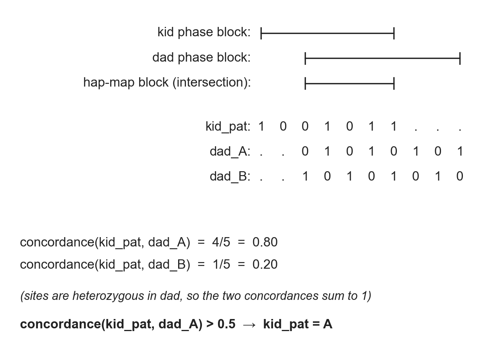

# Parent-phased methylation (Step 3)

This page is part of the
[trio-wise workflow](../index.md). It covers Step 3 of the trio-wise
pipeline — `phase_meth_to_parent_haps.py` and `hap_map_trio.py` —
which is the conceptual centre of tapestry's trio-wise side. Step 3
takes the single phasing produced upstream by pedMEC / whatshap and
uses it to relabel each per-CpG methylation measurement with one of
the four parental homologs of the trio (`A`/`B` in dad; `C`/`D` in
mom).

This page mirrors the structure of the pedigree-wise
[founder-phased-methylation page](../../pedigree_wise_workflow/founder_phased_methylation/founder_phased_methylation.md).
Read that page first for the general bit-vector machinery; this page
only spells out the two differences specific to the trio-wise case.

## The phasing, and where blocks meet

Unlike the pedigree-wise workflow — which combines a read-backed
phasing (hiphase) with a separate inheritance-based phasing
(`gtg-ped-map` + `gtg-concordance`) — the trio-wise workflow has a
single phasing source: **pedMEC / whatshap**, run once on the
trio's joint-called VCF
([`run-whatshap.sh:128`](https://github.com/quinlan-lab/tapestry/blob/ef018b59bac1cc7060ae31af4ffff9dbe09e6e5c/run-whatshap.sh#L128)).
That single run produces, for each individual, a set of *whatshap
phase blocks*, where the alleles inside one block are linked across
heterozygous sites and across blocks the labels are independent.
Tapestry parses those blocks per individual via
[`get_phase_blocks`](https://github.com/quinlan-lab/tapestry/blob/ef018b59bac1cc7060ae31af4ffff9dbe09e6e5c/src/phasing_trio.py#L7)
(called from
[`phase_meth_to_parent_haps.py:359–361`](https://github.com/quinlan-lab/tapestry/blob/ef018b59bac1cc7060ae31af4ffff9dbe09e6e5c/src/phase_meth_to_parent_haps.py#L359))
and parses paired kid-parent allele sequences from the pedMEC-phased
VCF in
[`get_all_phasing`](https://github.com/quinlan-lab/tapestry/blob/ef018b59bac1cc7060ae31af4ffff9dbe09e6e5c/src/phasing_trio.py#L48)
(called from
[`phase_meth_to_parent_haps.py:366`](https://github.com/quinlan-lab/tapestry/blob/ef018b59bac1cc7060ae31af4ffff9dbe09e6e5c/src/phase_meth_to_parent_haps.py#L366)).

The natural unit on which to relate the kid's phasing to a parent's
phasing is the **hap-map block**: the intersection of one of the
kid's whatshap phase blocks with one of the parent's whatshap phase
blocks. There are *two* such intersections per kid block — one with
dad and one with mom — handled independently and labelled
*paternal* and *maternal* downstream.

## Bit-vector match

Inside one paternal-side hap-map block, each het SNV in dad
contributes one bit to three parallel vectors:

- `kid_pat` — the kid's allele on the paternal homolog (kid's
  whatshap `hap1`, by tapestry's convention that pedMEC orders the
  kid as `pat|mat`).
- `dad_A` — dad's allele on hap1 (= `A` by definition).
- `dad_B` — dad's allele on hap2 (= `B` by definition).

`kid_pat` is compared against `dad_A` and `dad_B` in turn. Since
every contributing site is heterozygous in dad, `dad_A` and `dad_B`
carry opposite alleles at each site; consequently the per-site match
is mutually exclusive, and
`concordance(kid_pat, dad_A) + concordance(kid_pat, dad_B) = 1`
exactly. The decision is a single threshold:

- If `concordance(kid_pat, dad_A) > 0.5` → kid's paternal homolog
  in this block is `A` (and would have been `B` otherwise).

This decision is made once per paternal-side hap-map block; the
relevant code is the bit-vector comparison in
[`_build_hap_map`](https://github.com/quinlan-lab/tapestry/blob/ef018b59bac1cc7060ae31af4ffff9dbe09e6e5c/src/hap_map_trio.py#L10),
specifically the `similarity > 0.5` branch at
[line 71](https://github.com/quinlan-lab/tapestry/blob/ef018b59bac1cc7060ae31af4ffff9dbe09e6e5c/src/hap_map_trio.py#L71); the
`(A, B)` label pair is wired in at
[`get_hap_map`](https://github.com/quinlan-lab/tapestry/blob/ef018b59bac1cc7060ae31af4ffff9dbe09e6e5c/src/hap_map_trio.py#L113)
(called from
[`phase_meth_to_parent_haps.py:375`](https://github.com/quinlan-lab/tapestry/blob/ef018b59bac1cc7060ae31af4ffff9dbe09e6e5c/src/phase_meth_to_parent_haps.py#L375)).
The maternal side is symmetric: replace `kid_pat`/`dad_A`/`dad_B`
with `kid_mat`/`mom_C`/`mom_D` and intersect the kid's phase block
with mom's instead of dad's.

## Relabelling per-CpG methylation

Per-CpG methylation has already been stratified by each individual's
whatshap `hap1`/`hap2` partition by the time Step 3 runs: Step 2
([`aligned_bam_to_cpg_scores.sh`](https://github.com/quinlan-lab/tapestry/blob/ef018b59bac1cc7060ae31af4ffff9dbe09e6e5c/aligned_bam_to_cpg_scores.sh#L1))
calls pb-CpG-tools once on each HP-tagged BAM, so each per-CpG
methylation level is computed only over reads carrying the same HP
tag. Step 3 does not recompute those per-haplotype levels — it
*relabels* them. Inside
[`phase_meth_to_parent_haplotypes`](https://github.com/quinlan-lab/tapestry/blob/ef018b59bac1cc7060ae31af4ffff9dbe09e6e5c/src/phase_meth_to_parent_haps.py#L45)
(called once at
[line 407](https://github.com/quinlan-lab/tapestry/blob/ef018b59bac1cc7060ae31af4ffff9dbe09e6e5c/src/phase_meth_to_parent_haps.py#L407)),
the kid's `hap1`/`hap2` and each parent's `hap1`/`hap2` are renamed
to the parent-letter alphabet: kid `hap1`/`hap2` → `kid_pat`/`kid_mat`,
dad `hap1`/`hap2` → `dad_A`/`dad_B`, mom `hap1`/`hap2` →
`mom_C`/`mom_D` ([lines 80–110](https://github.com/quinlan-lab/tapestry/blob/ef018b59bac1cc7060ae31af4ffff9dbe09e6e5c/src/phase_meth_to_parent_haps.py#L80)).
The paternal and maternal hap maps are then overlaid onto each CpG
([lines 117–155](https://github.com/quinlan-lab/tapestry/blob/ef018b59bac1cc7060ae31af4ffff9dbe09e6e5c/src/phase_meth_to_parent_haps.py#L117)),
and CpGs that fall outside any hap-map block on a given parental
side are nulled out on that side
([lines 157–260](https://github.com/quinlan-lab/tapestry/blob/ef018b59bac1cc7060ae31af4ffff9dbe09e6e5c/src/phase_meth_to_parent_haps.py#L157)).
Note that, unlike the pedigree-wise workflow, there is no second
relabelling stage from `pat`/`mat` to founder letters: the trio-wise
output stops at the parental-letter alphabet `A`/`B`/`C`/`D` because
the kid's parents *are* the most distal individuals in this workflow.

## Mismatch sites

Most hap-map blocks have a small number of sites where `kid_pat`
disagrees with the chosen `dad_A`/`dad_B` vector — concordance < 1.
Those sites are recorded as `df_mismatch_pat` (and `df_mismatch_mat`
for the maternal side) alongside the hap-map block — see the
mismatch-collection branch at
[line 86](https://github.com/quinlan-lab/tapestry/blob/ef018b59bac1cc7060ae31af4ffff9dbe09e6e5c/src/hap_map_trio.py#L86) of
`hap_map_trio.py`, populated whichever way the
[`similarity > 0.5`](https://github.com/quinlan-lab/tapestry/blob/ef018b59bac1cc7060ae31af4ffff9dbe09e6e5c/src/hap_map_trio.py#L71)
branch went. Both mismatch DataFrames are returned by
[`get_hap_map`](https://github.com/quinlan-lab/tapestry/blob/ef018b59bac1cc7060ae31af4ffff9dbe09e6e5c/src/hap_map_trio.py#L113) and
written out to BED + VCF by
[`phase_meth_to_parent_haps.py:385–388`](https://github.com/quinlan-lab/tapestry/blob/ef018b59bac1cc7060ae31af4ffff9dbe09e6e5c/src/phase_meth_to_parent_haps.py#L385)
for the same downstream proximity-flag QC that the pedigree-wise
workflow performs in Step 4.
